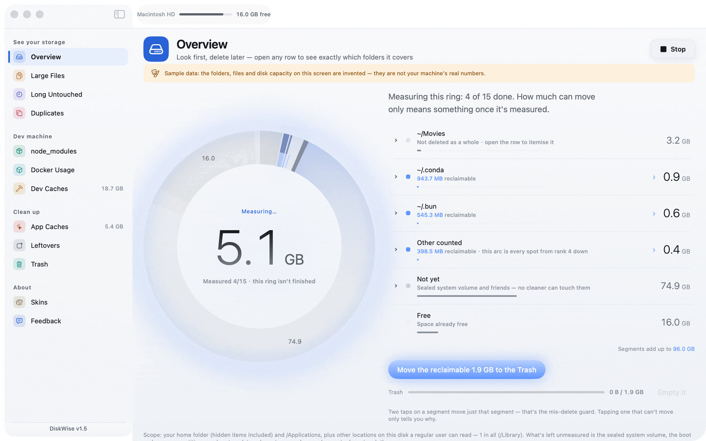

<div align="center">

# DiskWise

**macOS용 무료 오픈소스 CleanMyMac 대안.**


`node_modules`, Xcode `DerivedData`, Docker 볼륨, 앱 캐시, 삭제하고 남은 잔여 파일을 정리하는 SwiftUI
네이티브 디스크 정리 도구입니다. 그리고 **실제로는 아무것도 지우지 않습니다** —— 모든 삭제는 휴지통으로
가고, *사용자* 가 휴지통을 비울 때까지 되돌릴 수 있습니다. Electron 없음, Python 사이드카 없음, 로컬
서버 없음, 텔레메트리 없음, 구독 없음. UI는 10개 언어. DMG는 약 5 MB이고 Apple Silicon과 Intel을 한
파일에 담았습니다.

[English](./README.md) | [简体中文](./README.zh-CN.md) | [日本語](./README.ja.md) | 한국어



*스캔 → 행 열기 → 두 번 탭 → 되돌리기. 합성한 홈 폴더에서 찍었기 때문에 화면의 숫자는 전부 지어낸
것입니다 —— 맨 위 주황색 띠가 그렇게 적고 있습니다.*

</div>

> 이 문서는 [README.md](./README.md)(영어)의 번역입니다. 내용이 어긋날 경우 영어판이 기준입니다.
> 스크린샷과 데모는 영어 UI로 촬영했습니다.

```sh
brew install --cask dreamofxm/diskwise/diskwise
```

또는 **Mac App Store** 에서(macOS 13+, 무료, 이후 버전은 스토어가 알아서 챙겨 줍니다):
[DiskWise: Storage Cleaner](https://apps.apple.com/app/id6813265402)

파일을 직접 받는 편이 낫다면 [최신 GitHub 릴리스](https://github.com/DreamOfXM/diskwise/releases/latest)
—— 릴리스마다 DMG의 SHA-256이 함께 올라갑니다.

---

## 목차

- [빠른 시작](#빠른-시작)
- [왜 만들었나](#왜-만들었나)
- [무엇을 하는가](#무엇을-하는가)
- [스크린샷](#스크린샷)
- [설치](#설치)
- [소스에서 빌드하기](#소스에서-빌드하기)
- [자주 묻는 질문](#자주-묻는-질문)
- [알려진 한계](#알려진-한계)
- [로드맵](#로드맵)
- [피드백](#피드백)
- [개인정보](#개인정보)
- [라이선스](#라이선스)

## 빠른 시작

이 페이지 맨 위의 GIF가 바로 이 순서를 재생합니다:

1. **공간 개요** 를 엽니다 —— 볼륨 전체를 훑고 결과를 링 하나로 그립니다. 링 옆이 대장입니다.
2. 대장의 아무 행이나 클릭합니다 —— 그 행 아래의 폴더가 그 자리에서 펼쳐지고, 링은 작은 참조 다이얼로
   물러섭니다.
3. 통째로 옮길 수 있는 호를 **두 번** 클릭합니다: 첫 번째에 장전되고, 두 번째에 휴지통으로 갑니다.
   *되돌리기* 로 원래대로 돌아오고, 휴지통을 비우는 일은 끝까지 Finder의 몫입니다.

## 왜 만들었나

디스크 정리 도구는 쓸모 있는 말을 하기 전에 먼저 사용자의 기기를 아주 많이 읽어야 합니다. 같은 부류의
제품 대부분은 소스가 닫혀 있고, 상주 데몬을 달고 다니며, `rm -rf` 를 자랑거리로 내세웁니다.

DiskWise는 반대로 갑니다:

| | DiskWise |
|---|---|
| 삭제 경로 | **하나뿐** —— `FileManager.trashItem`. 모든 것이 휴지통으로 들어갑니다. |
| 되돌리기 | 지원합니다. 작업 단위로, 세션 내내. |
| 보호 경로 | 홈 디렉터리 자체, `~/Library` 등은 통째로 지울 수 없습니다. |
| 휴지통 비우기 | 실행하는 쪽은 언제나 **Finder** 이고 이 앱이 아닙니다. 직접 배포판: 앱이 Finder에 요청하고 Finder가 한 번 더 확인합니다. App Store판: 샌드박스가 그 이벤트를 막아버려서(실측 결과, 권한 대화상자조차 뜨지 않습니다) 같은 버튼이 휴지통 창을 열고 ⌘⇧⌫ 를 누르게 합니다. |
| Docker 이미지 | 읽기 전용. 가상 디스크에는 이미지별 경로가 없어서, 앱은 지우는 척하지 않고 위치를 알려줍니다. |
| 네트워크 | 없음. 업데이터도 분석도 광고도 없습니다. |
| 가격 | 무료. 이 빌드에서는 모든 기능과 스킨 6종이 열려 있습니다. |
| 실행 형태 | `.app` 하나. Python 없음, 포트 없음, 데몬 없음. |

캐시 목록은 설명할 수 있는 항목에는 설명을 답니다 —— 이것이 무엇인지, 지우면 어떻게 되는지, 어떻게
돌아오는지. 정말로 이해한 항목에만 이 글을 쓰기 때문에 설명이 붙은 행과 그렇지 않은 행이 있습니다.
WeChat, DingTalk, WeCom이 들어 있는 이유는 많은 기기에서 이 셋만으로 수십 GB를 차지하기 때문입니다.

대상은 개발자가 몇 년 쓴 기기입니다 —— `node_modules`, Docker 볼륨, Xcode `DerivedData`, 그리고 십수 GB의
캐시가 조용히 자리를 차지한 그런 기기입니다.

## 무엇을 하는가

**용량 파악하기**

- **공간 개요** —— 볼륨을 링 하나로 그립니다. 한 구획은 이번 스캔에서 실제로 잰 바이트이고, 구획을 모두
  더하면 디스크 전체가 됩니다(상위 폴더 ＋ 나머지 집계됨 ＋ 측정 못 함 ＋ 정리 가능 ＋ 여유).
  - 빛의 띠는 지금까지 잰 경계에 정확히 멈춰 섭니다.
  - 통째로 옮길 수 있는 구획은 두 번 탭합니다: 첫 번째에 장전되고 두 번째에 휴지통으로 가며, 3초 동안
    아무것도 하지 않으면 스스로 풀립니다.
  - 목록은 하나뿐입니다. 링 옆의 대장입니다. 행을 열면 내역이 그 자리에서 펼쳐집니다 —— 그 아래의 폴더,
    *나머지 집계됨* 뒤에 있는 위치들, *측정 못 함* 뒤에 있는 볼륨들.
  - 행을 열어 둔 동안 링은 작은 참조 다이얼로 물러서고, *Finder에서 보기* 와 *파고들기* 가 그 행에
    붙습니다.
- **디스크 전체 훑기** —— 범위를 짐작하게 두지 않습니다. 오픈소스 빌드는 볼륨 전체를 걷습니다(허용 목록의
  시스템 루트도, 다른 사용자의 홈도 포함합니다). 샌드박스된 Mac App Store 빌드는 부여받은 권한이 닿는
  데까지 걷고 그 경계를 화면에 적습니다.
  - 어느 쪽이든 대상은 볼륨 전체이며, 홈 폴더의 말끔한 구석만이 아닙니다.
- **못 잰 곳을 이름으로 짚는 커버리지 줄** —— 개요는 사용 중인 용량 가운데 실제로 잰 것이 얼마인지
  밝히고, 나머지가 누구 땅인지 나열합니다: 시스템 볼륨, 관리자만 읽을 수 있는 폴더, 전체 디스크 접근
  권한에 막힌 폴더.
  - *접근 허용* 버튼은 보호된 파일을 실제로 읽어 보아 권한이 정말로 모자랄 때만 나타납니다. 이미 허용한
    기기가 다시 재촉당하는 일은 없습니다.
  - 숫자는 모두 10진수라 Finder와 '이 Mac에 관하여' 와 바이트 단위로 맞습니다.
- **'나머지 집계됨' 은 합이 맞습니다** —— 그 행을 열면 호 뒤에 있는 위치가 모두 나열되고, 마지막 줄이
  합계를 내역과 함께 풀어 씁니다(나열한 행 ＋ 100 MB 기준 아래에 들어간 것들). "100 GB가 넘으니 믿으세요"
  는 설명이 아니기 때문입니다.
- **큰 파일** —— 같은 루트들을 가로질러 상위 N개. 개발 디렉터리는 건너뛸 수 있습니다.
- **오래 손대지 않은 것** —— 같은 루트들에서 N일 동안 열지 않은 파일.
- **중복 파일** —— 크기 → 부분 해시 → 전체 해시 순으로 묶고, 각 묶음에서 가장 최근 것을 잠가 두어 유일한
  사본을 지워 버리는 사고를 막습니다.
  - venv / site-packages / DerivedData 안에 사는 사본은 비교에 넣지 않고 따로 나열합니다. 하나를 지우면
    그 환경이 한 조각 부족해지기 때문입니다.

**개발 기기 전용**

- **node_modules** —— 프로젝트 단위로 묶어 훑기 때문에 "이 저장소 3개가 4.7 GB" 라고 바로 보입니다.
- **Docker 사용량** —— 실제로 설치된 컨테이너 런타임(Docker Desktop, OrbStack, Podman, colima)마다 한
  행씩, 그 가상 디스크가 이 디스크에서 차지한 양을 재고 엔진이 스스로 보고하는 수치를 아래에 나열합니다.
  읽기 전용이라 어디를 정리해야 하는지 가리킬 뿐, 대신 지워 주지 않습니다.

**정리하기**

- **앱 캐시** —— 손질된 지식 베이스(시스템 캐시, 크래시 덤프, WeChat / DingTalk / WeCom / QQ 등). 항목마다
  *이것이 무엇인지*, *지우면 어떻게 되는지*, *어떻게 되돌리는지* 를 설명하고 안전 / 주의 배지를 답니다.
- **개발 캐시** —— 같은 지식 베이스의 나머지 절반, 이런 기기가 실제로 디스크를 채우는 도구들: Homebrew,
  npm / pnpm / yarn, Maven, Gradle, conda, uv, cargo, Ollama 모델, Xcode 아카이브, DerivedData, 그리고
  시뮬레이터 기기를 하나씩.
- **잔여 파일** —— 이미 지운 앱이 남긴 데이터를, 지금 설치된 모든 앱의 bundle id와 대조해 찾습니다. 많이
  지우기보다 덜 보고하는 쪽으로 기웁니다.
- **휴지통** —— 세션 통계, 되돌리기 스택, 그리고 *비우기* 버튼: 샌드박스 밖에서는 Finder에게 비우기를
  부탁하고, App Store 빌드에서는 휴지통 창을 열어 ⌘⇧⌫ 를 누르게 합니다.

**개인화**

- **스킨** —— 6종. 흥미로운 점은 색만 바꾸는 게 아니라는 것입니다. 하나하나가 글꼴, 모서리 반경, 떠오르는
  방식, 움직임의 결, 차트 배색을 바꿉니다. Morning Fog, Graphite, Mint, Polar Night, Aurora Glass,
  Ink & Paper —— 여섯 종 모두 함께 들어 있습니다.
- **스킨은 코드가 아니라 데이터** —— 여섯 종 모두
  [`Sources/DiskCleaner/Resources/skins.json`](Sources/DiskCleaner/Resources/skins.json) 파일 하나에
  있고, 그 파일이 자기 필드를 스스로 설명합니다. 일곱 번째는 JSON 객체 하나입니다: GitHub 웹에서 그 파일을
  고치고 PR을 올리면 끝이고, Xcode도 빌드도 Swift도 필요 없습니다.

## 스크린샷

※ 아래는 영어 UI로 촬영했습니다. 앱은 같은 화면을 10개 언어로 그립니다.

| 공간 개요 | 중복 파일 |
|---|---|
|  |  |

| 개발 캐시 | 잔여 파일 |
|---|---|
|  |  |

스킨 페이지는 테마마다 **실제 썸네일** 을 그립니다 —— 미니 사이드바, 링 게이지, 행, 버튼까지 그 스킨의
진짜 토큰으로 그리기 때문에, 입어 보기 전에 골격을 알 수 있습니다:


스킨 여섯, 골격 여섯. 같은 페이지 셋 —— Graphite가 어두운 쪽입니다:

| Graphite | Mint | Polar Night |
|---|---|---|
|  |  |  |

UI는 10개 언어 —— 영어, 简体中文, 繁體中文, 日本語, 한국어, Deutsch, Español, Français, Русский,
Português(브라질) —— 이고 스킨 페이지의 언어 메뉴에서 바꿀 수 있으며 기본값은 시스템 언어입니다. 수 표현도
영어를 그대로 붙이지 않고 언어마다 굴절합니다. 러시아어는 수마다 형태를 고르고(`1 файл`, `3 файла`,
`11 групп`), 독일어와 로망스어는 단수·복수를 구분하며, 일본어와 한국어는 각 언어가 실제로 쓰는 조수를
씁니다.

## 설치

### Mac App Store

[DiskWise: Storage Cleaner](https://apps.apple.com/app/id6813265402) —— macOS 13+, 무료. 설치하면 바로
쓸 수 있고, 이후 버전은 스토어가 이어서 처리합니다.

### Homebrew(명령 하나)

```sh
brew install --cask dreamofxm/diskwise/diskwise
```

서드파티 tap에서 이게 통하는 건 완전 수식 이름 덕분입니다. Homebrew 6부터 비공식 tap은 기본적으로
신뢰되지 않고, 완전 수식 이름으로 설치하면 이 cask 하나만 신뢰됩니다. 짧은 이름을 쓰고 싶다면:

```sh
brew tap DreamOfXM/diskwise
brew trust --cask dreamofxm/diskwise/diskwise
brew install --cask diskwise
```

tap의 세부 사항과 고정된 체크섬을 올리는 방법은
[DreamOfXM/homebrew-diskwise](https://github.com/DreamOfXM/homebrew-diskwise) 에 있습니다.

Homebrew가 설치하는 것은 Releases 페이지에 있는 것과 같은 파일이라, 첫 실행은 여전히 Gatekeeper를
지납니다. macOS가 한 번 막으면 **시스템 설정 → 개인정보 보호 및 보안 → 확인 없이 열기** 에서 허용하십시오
(macOS 13–14에서는 우클릭 → 열기 도 같은 일을 합니다). **Mac App Store** 에서 받으면 이 단계가 아예
없습니다.

### DMG

1. [Releases](https://github.com/DreamOfXM/diskwise/releases) 에서
   `DiskWise-<버전>[-universal].dmg` 를 내려받습니다.
2. 열어서 **DiskWise.app** 을 *응용 프로그램* 으로 끌어다 놓습니다.
3. 첫 실행이 한 번 막힙니다. **시스템 설정 → 개인정보 보호 및 보안 → 확인 없이 열기** 에서 허용하면
   그다음부터는 정상적으로 열립니다(macOS 13–14에서는 우클릭 → 열기 가 대신 통했지만 Sequoia가 이
   지름길을 없앴습니다).

`ARCH=universal` 로 만든 릴리스는 `…-universal.dmg` 라는 이름으로 Apple Silicon과 Intel 슬라이스를 한
파일에 담습니다. Apple Silicon 전용은 `DiskWise-<버전>.dmg` 입니다. 체크섬은 릴리스 자산 옆에 공개되고,
cask도 같은 SHA-256을 고정합니다.

## 소스에서 빌드하기

필요한 것은 Xcode 커맨드 라인 도구뿐입니다. **전체 Xcode는 필요하지 않습니다.**

```bash
swift build                    # 디버그
swift run SelfTest             # 전부 초록이 배포의 전제 조건
swift run DiskCleaner          # 앱 실행
bash build_app/build.sh        # 번역 검사 → 빌드 → 자체 테스트 → .app → 서명 → dist/*.dmg + SHA256
```

세 관문 가운데 하나라도 실패하면 `build.sh` 는 패키지를 만들지 않습니다: 번역 누락, 자체 테스트 실패,
리소스 미반영입니다. 번역 관문은 Swift 소스와 `skins.json` 을 직접 해석하기 때문에, 번역이 빠진 경우뿐
아니라 `L(…)` 로 감싸지 않은 사용자 노출 문자열도 잡아냅니다 —— 어떤 언어가 절반만 번역된 채 조용히
출시되는 일은 없습니다.

기여하려면 [CONTRIBUTING.md](CONTRIBUTING.md) 부터, 그다음
[docs/ARCHITECTURE.md](docs/ARCHITECTURE.md) 와 [docs/DESIGN.md](docs/DESIGN.md) 를 읽어 보십시오. 둘 다
비싸게 배운 규칙을 담고 있습니다. Swift를 전혀 건드리지 않는 PR이 세 가지 있습니다:
[캐시 지식 베이스](CONTRIBUTING.md#the-easiest-useful-contribution-cache-knowledge-base) 항목 하나,
[스킨](CONTRIBUTING.md#skins), 그리고 [번역](CONTRIBUTING.md#translations) 입니다.

## 자주 묻는 질문

**CleanMyMac 대안인가요?**
같은 영역을 덮는다는 뜻에서는 그렇습니다 —— 캐시, 큰 파일, 중복 파일, 잔여 파일, Docker 사용량 —— 소스는
이 페이지에 있고 구독도 없습니다. 다만 제품군보다 *일부러* 적게 합니다: 악성코드 검사 없음, VPN 없음,
메일 정리 없음, "속도 향상" 없음. 그것들은 다른 제품이고 다른 위험이기 때문입니다.

**정말 필요한 것까지 지우지 않을까요?**
지운 것은 모두 휴지통으로 들어가고, 세션 동안 되돌리기 스택이 남습니다. 홈 디렉터리 자체와 `~/Library` 는
통째로 지울 수 없습니다. 휴지통을 비우는 것은 Finder의 일이라, 용량이 실제로 풀리기 전에 macOS가 한 번 더
확인합니다.

**`node_modules`, `DerivedData`, 캐시를 지워도 되나요?**
`node_modules` 는 `npm install` 로, `DerivedData` 는 다음 Xcode 빌드로, 캐시는 그 캐시를 쓴 도구의 다음
실행으로 돌아옵니다. DiskWise는 그것을 안다고 전제하지 않고 항목마다 적어 둡니다 —— 캐시의 각 행이 무엇인지,
지우면 어떻게 되는지, 어떻게 되돌리는지 말해 줍니다.

**어딘가로 데이터를 보내나요?**
아니요. 업데이터도, 분석도, 계정도, 광고도 없습니다 —— 앱에는 네트워크 접근이 전혀 없습니다. 피드백이
GitHub, 이메일, 아래 QQ 그룹을 거치는 것도 그 때문입니다.

**WeChat / DingTalk / WeCom 캐시도 다루나요?**
다룹니다. 캐시 지식 베이스에 들어 있습니다. 중국 개발자의 Mac에서는 이 항목들이 홀로 가장 큰 용량
소비자인 경우가 많기 때문입니다. 중국어 간체와 번체가 둘 다 일등 시민인 것도, 영어 UI에 나중에 붙인
번역이 아니기 때문입니다.

**Intel Mac은요?**
v1.3부터 공개한 DMG는 모두 `ARCH=universal` 로 만들어 arm64와 x86_64 슬라이스를 한 파일에 담으므로,
같은 다운로드가 Apple Silicon과 Intel에서 모두 동작합니다. v1.3 이전 릴리스는 arm64만 담은
`DiskWise-<버전>.dmg`(이름에 `-universal` 없음)라, 그 버전에서 Intel을 쓴다면 소스에서 빌드하십시오
(1분이면 끝나고 Xcode는 필요 없습니다). `bash build_app/build.sh` 는 여전히 기본이 Apple Silicon이고,
둘 다 얻으려면 `ARCH=universal` 을 넘깁니다.

**왜 첫 실행에서 macOS가 경고하나요?**
직접 내려받은 것만, 그것도 처음 한 번만 그렇습니다: **시스템 설정 → 개인정보 보호 및 보안 → 확인 없이
열기** 에서 허용하면 이후로는 정상입니다. macOS 13–14에서는 우클릭 → 열기 도 같았지만 Sequoia가 이
지름길을 없앴습니다. App Store 빌드는 막히지 않습니다.

## 알려진 한계

- **시스템 영역은 세기만 하고 정리하지 않습니다.** `/Library`, `/opt`, `/private` 아래의 행에는 *시스템
  영역* 배지가 붙고 체크박스가 잠깁니다. 관리자만 쓸 수 있거나 Homebrew / Xcode의 것이라, 각자의 정리
  명령이 더 잘하기 때문입니다.
- **큰 `node_modules` 훑기는 느리고**, 아직 결과를 스트리밍하지 않습니다.
- **모든 잔여 파일을 찾지는 않습니다.** 잔여 파일 탐지는 의도적으로 보수적입니다.

## 로드맵

- [ ] 느린 스캔을 위한 스트리밍 스냅샷
- [ ] 캐시 지식 베이스 항목 늘리기(PR을 올리는 것이 가장 쉬운 기여 방법입니다)

## 피드백

앱에 네트워크 접근이 없으므로 내장된 "피드백 보내기" 버튼도 없습니다. 원하는 경로를 고르십시오:

| 경로 | 위치 |
|---|---|
| 이메일 | [hnyxgxm2009@163.com](mailto:hnyxgxm2009@163.com) |
| QQ 그룹 | **913022339** —— 스캔해서 참여 |
| GitHub | [이슈 열기](https://github.com/DreamOfXM/diskwise/issues) —— 영어도 중국어도 괜찮습니다 |


같은 세 경로가 앱 안에도 있습니다: 사이드바 맨 아래 **피드백** 페이지에서 모든 주소를 한 번에 복사할 수
있습니다.

## 개인정보

DiskWise는 네트워크에 접속하지 않고 아무것도 수집하지 않습니다 —— 모든 스캔은 사용자의 Mac에서
끝납니다. 전문은 [docs/PRIVACY.md](docs/PRIVACY.md) 에 있습니다.

## 라이선스

Apache License 2.0 —— [LICENSE](LICENSE) 를 참고하십시오.
