<div align="center">

# DiskWise

**A free, open-source CleanMyMac alternative for macOS.**

A native SwiftUI disk cleaner for `node_modules`, Xcode `DerivedData`, Docker volumes, app
caches and uninstall leftovers — and it never truly deletes anything: every removal goes to
the Trash and stays undoable until *you* empty it. No Electron, no Python sidecar, no local
server, no telemetry, no subscription. A ~4 MB DMG, one file for Apple Silicon and Intel.

[English](#english) · [中文](#中文)


</div>

```sh
brew install --cask dreamofxm/diskwise/diskwise
```

Rather download it? [Latest release](https://github.com/DreamOfXM/diskwise/releases/latest) —
every release ships the DMG's SHA-256.

---

<a name="english"></a>

## Why this exists

Disk cleaners ask for a lot of trust: they walk your whole home folder, then offer to delete things.
Most of them are closed-source, ship a background daemon, and treat `rm -rf` as a feature.

DiskWise takes the opposite bet:

| | DiskWise |
|---|---|
| Delete path | **One** — `FileManager.trashItem`. Everything lands in the Trash. |
| Undo | Yes, per operation, for the whole session. |
| Protected paths | Home itself, `~/Library`, and friends can never be removed wholesale. |
| Emptying the Trash | Handed to **Finder**, so macOS asks you once more. |
| Docker images | Read-only. Virtual disks have no per-image path, so the app points instead of pretending. |
| Network | None. No updater, no analytics, no ads. |
| Price | Nothing. Every feature and all six skins ship unlocked in this build. |
| Runtime | A single `.app`. No Python, no port, no daemon. |

It is built for machines that have been used by a developer for a few years — the ones where
`node_modules`, Docker volumes, Xcode `DerivedData`, and ten GB of caches quietly took over.

## What you get

**See the space**
- **Overview** — a segmented ring gauge whose slices add up to the whole volume (top folders + everything else counted + not measured + purgeable + free), plus the fattest folders, each with *Reveal* and *Dig in*.
- **Whole-disk sweep** — no scope to guess at: the open-source build walks the whole volume (whitelisted system roots included, other users' homes included), the sandboxed Mac App Store build walks everything its grant can reach and says so. Either way it covers the volume, not just the tidy corners of your home folder.
- **An honest coverage line** — the overview states how much of your used space it actually measured, and names the rest: system volumes, admin-only folders, and folders blocked on Full Disk Access — and the *Grant access* button only appears when a real read of a protected file says the permission is actually missing. Every number is decimal, so it matches Finder and About This Mac byte for byte.
- **The "Other counted" slice adds up** — a boundary line sits directly above the rows that make that arc, and the line below the list spells it out part by part (those rows, the folders behind *Show the rest*, and the small ones under the 100 MB floor), because "a hundred-plus GB, trust me" is not an explanation.
- **Large Files** — top N across the same roots, dev directories skippable.
- **Long Untouched** — files you haven't opened in N days, across the same roots.
- **Duplicates** — size → partial hash → full hash, grouped, oldest copy locked so you can't nuke the only one.

**Dev machine specials**
- **node_modules** — project sweep grouped per project, so you see "these 3 checkouts cost 4.7 GB".
- **Docker Usage** — read-only breakdown of the Docker Desktop data store, with the pointer on where to prune.

**Clean up**
- **Caches** — a curated knowledge base (Homebrew, npm, yarn, Maven, Gradle, conda, Xcode, simulators, WeChat / DingTalk / WeCom / QQ …). Every entry explains *what it is*, *what happens if you delete it*, and *how to get it back*, with a Safe / Careful badge.
- **Leftovers** — data orphaned by apps you already uninstalled, matched against the bundle IDs of everything still installed. Under-reports rather than over-deletes.
- **Trash** — session stats, undo stack, and an *Empty* button that routes through Finder.

**Personalize**
- **Skins** — 6 themes, and the interesting part is that they are not color swaps: each one changes typeface, corner radius, elevation, motion signature and chart palette. Morning Fog, Graphite, Mint, Polar Night, Aurora Glass, Ink & Paper — all six are in the box.

## Screenshots

| Overview | Duplicates |
|---|---|
| 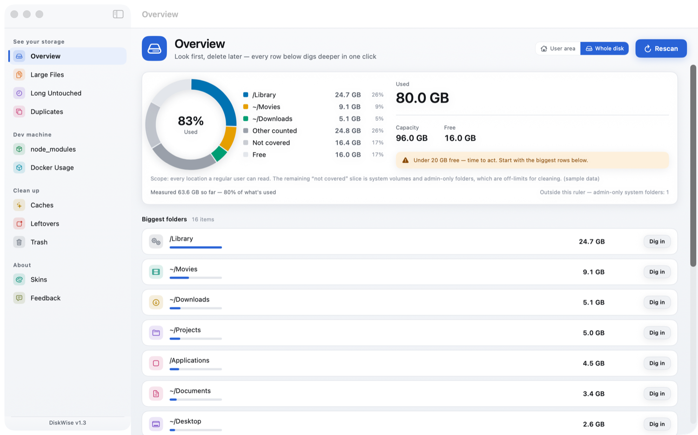 | 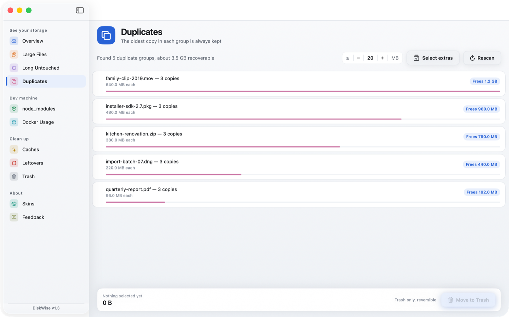 |

| Caches | Leftovers |
|---|---|
| 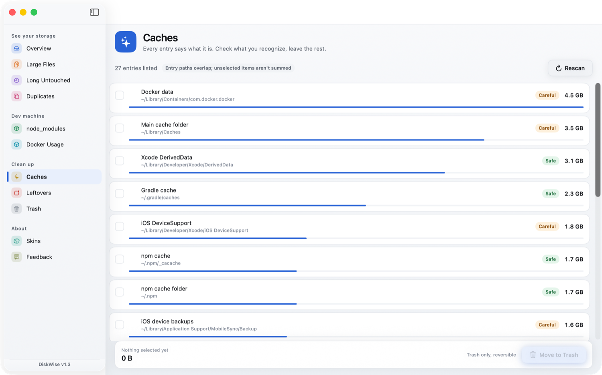 | 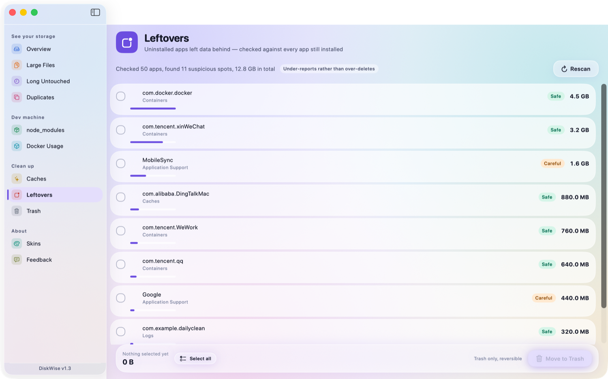 |

The skin store renders a **live thumbnail** of each theme — mini sidebar, ring gauge, rows and
buttons, all drawn with that skin's real tokens — so you can see the skeleton before you wear it:


Six skins, six skeletons. Same page, three of them:

| Graphite (dark) | Mint | Polar Night |
|---|---|---|
| 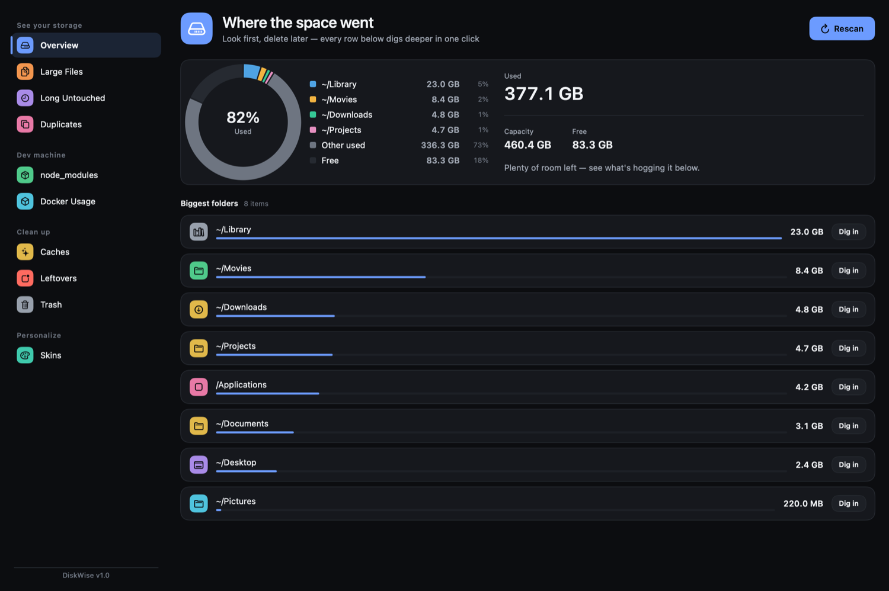 | 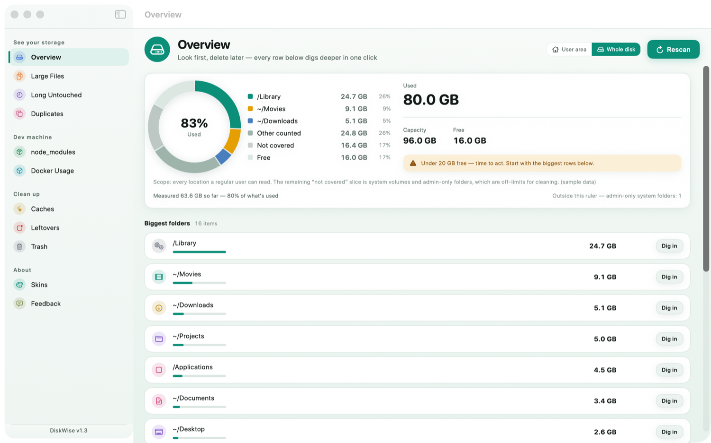 | 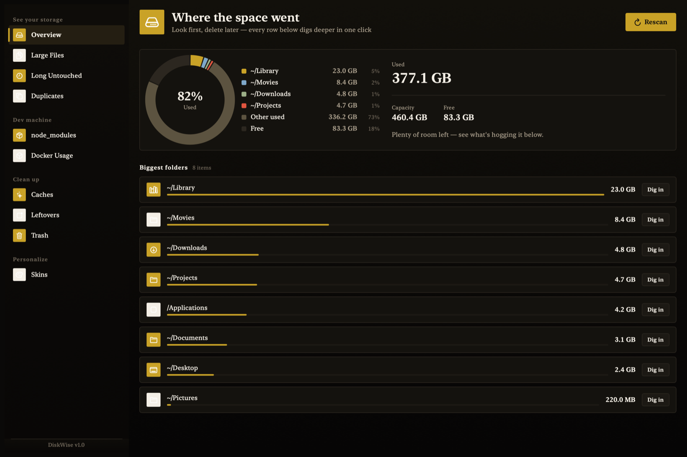 |

The UI is bilingual — English and Simplified Chinese, switchable in-app (Skins → language), and it
follows the system language by default. Same screens in Chinese:

| 空间总览 | 缓存清理 |
|---|---|
| 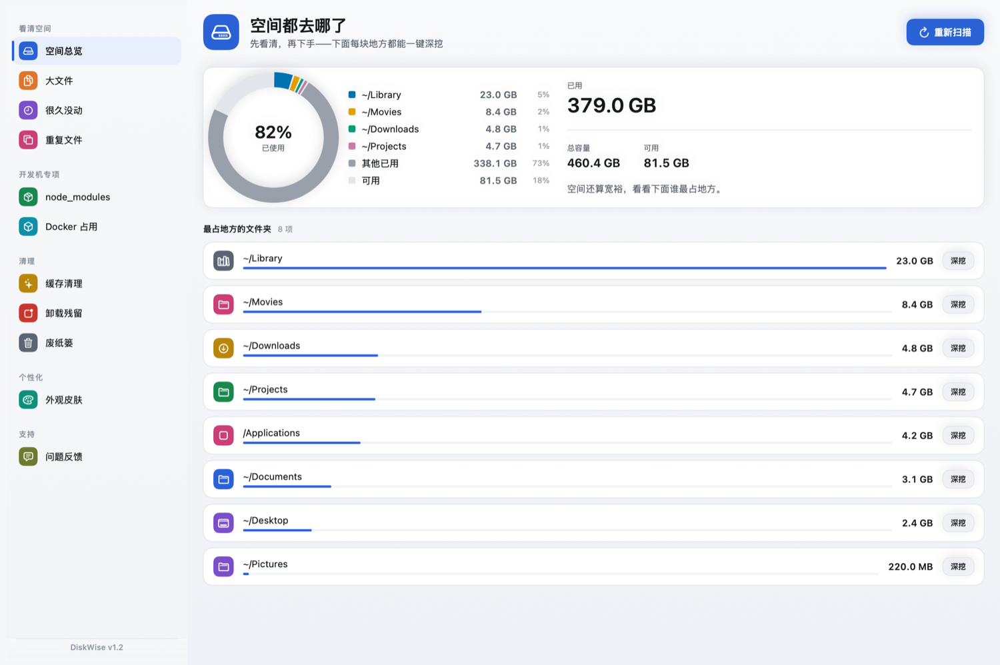 | 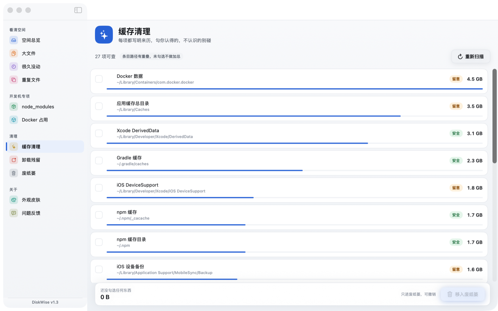 |

## Install

**Option A — Homebrew (one command)**

```sh
brew install --cask dreamofxm/diskwise/diskwise
```

The fully-qualified name is what makes this work from a third-party tap: since Homebrew 6
non-official taps are untrusted by default, and installing by full name trusts just this
cask. If you would rather use the short name:

```sh
brew tap DreamOfXM/diskwise
brew trust --cask dreamofxm/diskwise/diskwise
brew install --cask diskwise
```

Tap details and how the pinned checksum gets bumped: [DreamOfXM/homebrew-diskwise](https://github.com/DreamOfXM/homebrew-diskwise).

Homebrew does not skip Gatekeeper here: whatever the cask installs is the same build the
Releases page carries. **Read the release note of the version you are about to install** — it
says whether that build is Developer ID-signed and notarized (double-click) or ad-hoc signed
(first launch gets blocked, then you approve it in **System Settings → Privacy & Security →
Open Anyway**; macOS 13–14 also take the older right-click → Open). Everything published so far is ad-hoc.

**Option B — DMG**

1. Download `DiskWise-<version>[-universal].dmg` from
   [Releases](https://github.com/DreamOfXM/diskwise/releases).
2. Open it and drag **DiskWise.app** to *Applications*.
3. First launch depends on the build, and the release note for that version is the authority:
   a Developer ID-signed, notarized build opens with a double-click; an ad-hoc one gets blocked the
   first time, and you approve it in **System Settings → Privacy & Security → Open Anyway**
   (right-click → Open does that job on macOS 13–14, but Sequoia removed that shortcut).
   (See [Known limits](#known-limits).)

Releases built with `ARCH=universal` are named `…-universal.dmg` and carry both the Apple
Silicon and Intel slices in one file; the Apple Silicon-only ones are named `DiskWise-<version>.dmg`.
Checksums are published next to each release asset, and the cask pins the same SHA-256.

## Build from source

You need the Xcode Command Line Tools — **not** full Xcode.

```bash
swift build                    # debug
swift run SelfTest             # all green is the precondition for shipping
swift run DiskCleaner          # run the app
bash build_app/build.sh        # localize check → build → self-test → .app → sign → dist/*.dmg + SHA256
```

`build.sh` refuses to produce a package if any of the three gates fails: missing translations,
a failing self-test, or an unpacked resource. Releasing one — Developer ID signing, notarization,
the CI workflow, the pre-push checklist — is documented in [docs/RELEASE.md](docs/RELEASE.md).

Contributing? Start with [CONTRIBUTING.md](CONTRIBUTING.md), then
[docs/ARCHITECTURE.md](docs/ARCHITECTURE.md) and [docs/DESIGN.md](docs/DESIGN.md) — both encode
rules that were learned the expensive way. The most useful first PR is a
[cache knowledge base](CONTRIBUTING.md#the-easiest-useful-contribution-cache-knowledge-base) entry.

## FAQ

**Is this a CleanMyMac alternative?**
In the sense that it covers the same ground — caches, large files, duplicates, uninstall
leftovers, Docker usage — with the source on this page and no subscription. It deliberately
does *less* than a suite: no malware scan, no VPN, no mail cleanup, no "speed booster",
because those are different products with different risks.

**Can it delete something I actually need?**
Anything it removes lands in the Trash, and the session keeps an undo stack. Home itself and
`~/Library` can never be removed wholesale. Emptying the Trash is Finder's job, so macOS asks
you one more time before space is really gone.

**Is it safe to delete `node_modules`, `DerivedData`, caches?**
`node_modules` comes back with `npm install`, `DerivedData` with the next Xcode build, and
caches with the next run of the tool that wrote them. DiskWise states that per entry rather
than assuming you know it — each cache row says what it is, what happens if you delete it, and
how to get it back.

**Does it send data anywhere?**
No. No updater, no analytics, no account, no ads — the app has no network access at all, which
is also why feedback goes through GitHub, email or the QQ group below.

**What about WeChat / DingTalk / WeCom caches?**
They're in the cache knowledge base, because on a Chinese developer's Mac those are often the
single biggest consumers. That's also why the UI ships bilingual.

**Intel Mac?**
From v1.3 on, every published DMG is built with `ARCH=universal` and carries both the arm64 and
x86_64 slices in one file, so the same download works on Apple Silicon and Intel. Releases before
v1.3 shipped an arm64-only file (`DiskWise-<version>.dmg`, no `-universal` in the name); Intel
users on those versions need to build from source instead (it takes a minute and needs no Xcode).
`bash build_app/build.sh` still defaults to Apple Silicon; pass `ARCH=universal` to get both.

**Why does macOS complain on first launch?**
It depends on how that build was signed. `build.sh` uses a Developer ID certificate and
notarizes when the certificate and notarization credentials are present, and such a build opens
with a double-click. Without them it falls back to ad-hoc signing — which is what every release
published so far got — and a quarantined ad-hoc build gets blocked once, then approved in
**System Settings → Privacy & Security → Open Anyway** (see [Install](#install)). On macOS 13–14,
right-click → Open does the same job; Sequoia removed that shortcut. The release note of the
version you're downloading says which signing mode it is.

## Known limits

Honest list, because a cleanup tool earns trust by admitting what it can't do:

- **No auto-update.** You get new versions from the Releases page or `brew upgrade`.
- **Direct downloads are ad-hoc signed so far**, so the first launch gets blocked and has to be
  approved in System Settings → Privacy & Security. The Developer ID + notarization path is in
  `build.sh` and CI, waiting on a certificate.
- **Whole-disk scope counts the system area, it does not clean it.** Rows under `/Library`, `/opt` or
  `/private` come up with a *System area* badge and a locked checkbox: either only an admin can write
  there, or the files belong to Homebrew / Xcode, whose own cleanup commands do a better job.
- **Large `node_modules` sweeps are slow** and don't stream results yet.
- **It will not find every orphan.** Leftover detection is deliberately conservative.

## Roadmap

- [ ] Streaming snapshots for slow scans
- [ ] More cache knowledge base entries (open a PR — this is the easiest way to contribute)

## Feedback

The app has no network access, so there is no built-in "send feedback" button — pick a channel:

| Channel | Where |
|---|---|
| Email | [hnyxgxm2009@163.com](mailto:hnyxgxm2009@163.com) |
| QQ group | **913022339** — scan to join |
| GitHub | [Open an issue](https://github.com/DreamOfXM/diskwise/issues) — English or Chinese is fine |


The same three channels live in-app: the **Feedback** page at the bottom of the sidebar, with
copy buttons for every address.

## Privacy

DiskWise has no network access and collects nothing — every scan runs locally on your Mac.
Full policy: [docs/PRIVACY.md](docs/PRIVACY.md).

## License

Apache License 2.0 — see [LICENSE](LICENSE).

---

<a name="中文"></a>

## DiskWise 是什么

一个**不会真正删除任何东西**的 macOS 磁盘清理工具，CleanMyMac 的免费开源替代。所有删除只进废纸篓，
本次会话内随时可撤销；专治开发者机器上的 `node_modules`、Xcode `DerivedData`、Docker 虚拟盘、
微信 / 钉钉 / 企业微信缓存和卸载残留。SwiftUI 原生实现，没有 Electron、不依赖 Python、不起本地服务、
没有端口、不联网、无遥测、无订阅。安装包约 4 MB，一个文件同时带 Apple Silicon 和 Intel 两个切片。

## 它凭什么值得信任

清理工具天然要信任：它扫遍你的家目录，然后劝你删东西。多数同类产品闭源、常驻后台进程、把 `rm -rf` 当卖点。
DiskWise 押的是反面：

| | DiskWise |
|---|---|
| 删除路径 | **全 App 只有一条** —— `FileManager.trashItem`，一律进废纸篓 |
| 撤销 | 支持，按操作、整会话可退 |
| 保护路径 | 家目录本体、`~/Library` 等整体不可删，子项可以 |
| 清空废纸篓 | 交给**访达**执行，系统会再问你一次 |
| Docker 镜像 | 只读。虚拟盘没有独立路径，App 只指路不代删 |
| 联网 | 无。不自动更新、不统计、无广告 |
| 收费 | 无。功能全开，六套皮肤全部随包可用 |
| 运行形态 | 一个 `.app`，没有 Python、没有端口、没有守护进程 |

它服务的是被开发者用了几年的那类机器——`node_modules`、Docker 虚拟盘、Xcode `DerivedData`、
十几 GB 缓存悄悄把盘吃掉的那种。

## 功能

**看清空间**
- **空间总览**：分段环形仪表，各段加起来正好等于整块盘（前几大热点 + 其他已统计 + 没量到的地方 + 系统可清除 + 空闲）；下面列最占地方的文件夹，每行「访达显示 / 深挖」
- **走整盘扫描**：没有范围开关要猜。开源版整趟走整盘（白名单里的系统根、别人的家目录都在内），商店沙盒版走授权能达到的最大范围并把这个边界写在界面上。两边扫的都是整块盘，不是家目录里那几处整洁的角落
- **覆盖范围说实话**：总览常驻一行「已量到 X，占已用的 Y%」，并点名没量到的是谁的地盘——系统卷、只有管理员能读的目录、以及读不动的那几处。那颗跳「完全磁盘访问权限」设置的按钮只在实测读不到受保护文件时才出现，已经授权过的人不会再被喊一次「去授权」。所有体积按十进制算，跟访达、「关于本机」逐字节对得上
- **「其他已统计」凑得出来**：这块弧对应的那几行上面有一条分界线把它们框住，列表下面那句再把它逐段摊开（那几行 + 「展开其余」里那几处 + 不到 100 MB 的小目录），一百多 G 不能只写成一句「信我」
- **大文件**：按同一批范围根遍历，TOP 可调，可跳过开发目录
- **很久没动**：同样这些根里，N 天没打开的文件
- **重复文件**：大小 → 部分哈希 → 全量哈希，分组展示，每组日期最新一份锁定保留

**开发机专项**
- **node_modules**：按项目聚合，直接告诉你「这几个仓库共 4.7 GB」
- **Docker 占用**：Docker Desktop 数据目录只读明细 + 清理指路

**清理**
- **缓存清理**：知识库覆盖 Homebrew、npm、yarn、Maven、Gradle、conda、Xcode、模拟器、微信 / 钉钉 / 企业微信 / QQ 等。
  每项都写明「这是什么 / 删了会怎样 / 怎么恢复」，并给安全 / 留意分级
- **卸载残留**：以「还装着的 App 的 bundle id」为基准找孤儿，宁可漏报不误删
- **废纸篓**：体积统计、撤销栈、走访达的清空按钮

**个性化**
- **外观皮肤**：6 套。关键点是它们**不是换色**——每套各自改字体面、圆角、材质分层、动效签名、图表配色。
  晨雾 / 石墨 / 薄荷 / 极夜黑金 / 极光玻璃 / 水墨宣纸，六套全部随包可用。

## 界面截图

中英文双语，可在「外观皮肤」页顶部切换，默认跟随系统。

| 空间总览 | 重复文件 |
|---|---|
|  | 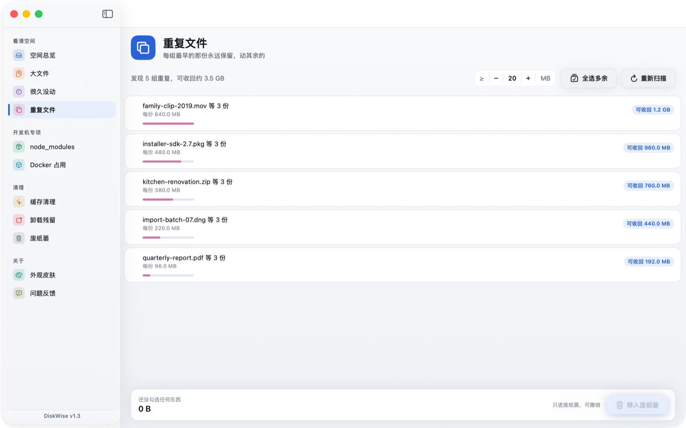 |

| 缓存清理 | 卸载残留 |
|---|---|
|  | 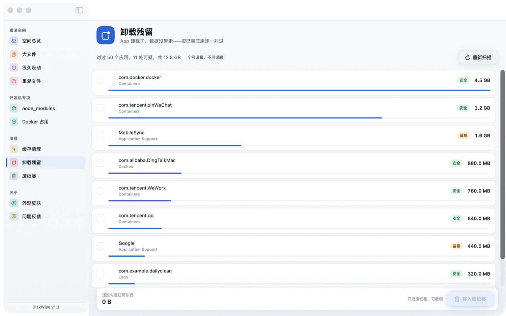 |

皮肤页里每张卡都实时渲染该皮肤下的迷你侧边栏 + 环形图 + 列表行 + 按钮，看得懂骨架再决定穿不穿：

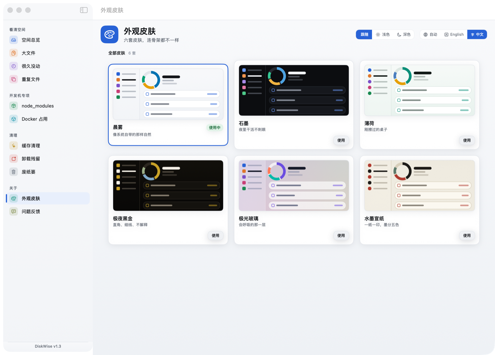

同一页，三套皮肤三种骨架（默认「晨雾」见上方总览图）：

| 石墨（深色） | 极夜黑金 |
|---|---|
| 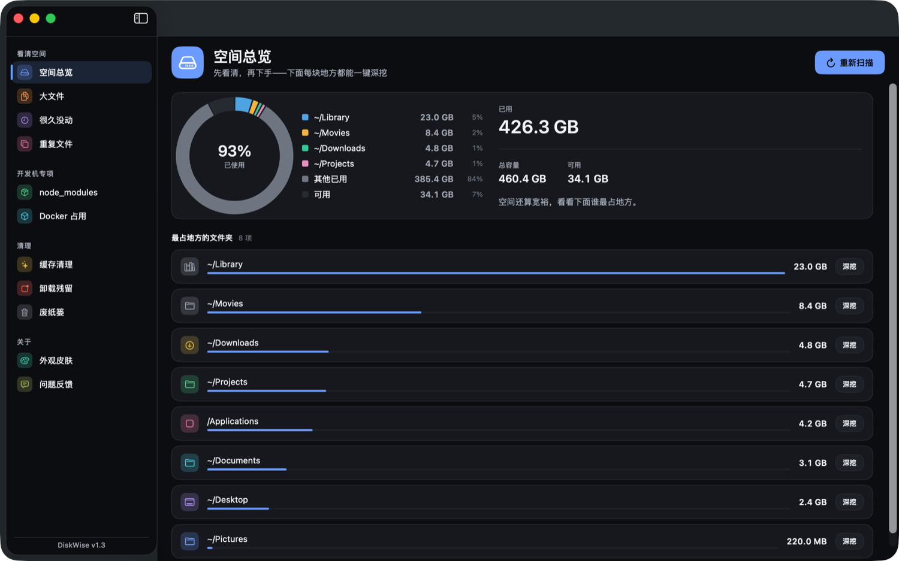 | 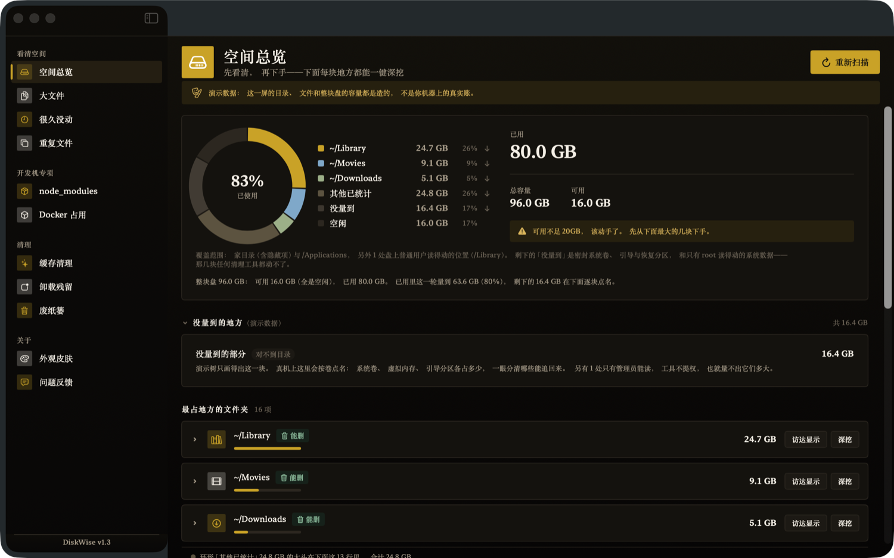 |

## 下载与安装

**方式一：Homebrew（一条命令）**

```bash
brew install --cask dreamofxm/diskwise/diskwise
```

必须用 `dreamofxm/diskwise/diskwise` 这个全限定名：Homebrew 6 起第三方 tap 默认不被信任，
按全限定名安装只信任这一个 cask。想用短名就先补一步信任：

```bash
brew tap DreamOfXM/diskwise
brew trust --cask dreamofxm/diskwise/diskwise
brew install --cask diskwise
```

tap 的细节与校验值怎么更新：[DreamOfXM/homebrew-diskwise](https://github.com/DreamOfXM/homebrew-diskwise)。

用 Homebrew 也躲不过 Gatekeeper——但装的就是 Releases 页那个包：**装之前读一眼那条 Release 的说明**，
里面写清了这一版是 Developer ID 签名 + 公证（双击即开）还是 ad-hoc 签名（首次会被拦一下，然后到
**系统设置 → 隐私与安全性 → 「仍要打开」**里放行；macOS 13–14 上右键 → 打开 也能顶过去）。
目前发出去的每一个包都是 ad-hoc。

**方式二：DMG**

1. 到 [Releases](https://github.com/DreamOfXM/diskwise/releases) 下载 `DiskWise-<版本号>[-universal].dmg`
2. 打开后把 **DiskWise.app** 拖进「应用程序」
3. 首次打开怎么点，以那条 Release 的说明为准：Developer ID 签名 + 公证过的双击即开；
   ad-hoc 的那份第一次会被拦下，再到**系统设置 → 隐私与安全性 → 「仍要打开」**里放行
   （macOS 13–14 上可以用老办法：右键 → 打开）（见[已知不足](#已知不足)）

`ARCH=universal` 出的包文件名带 `-universal`，同一个文件里同时有 arm64 和 x86_64 两个切片；
不带后缀的那份只有 Apple Silicon。每个 Release 都会附 DMG 的 SHA256，cask 里钉的是同一个校验值。

## 从源码构建

只需要 Xcode 命令行工具，**不需要完整 Xcode**。

```bash
swift build                    # debug 编译
swift run SelfTest             # 全量自检，全绿是打包前提
swift run DiskCleaner          # 直跑 App
bash build_app/build.sh        # 双语对账 → 编译 → 自检 → .app → 签名 → dist/*.dmg + SHA256
```

三道闸门任一失败就不出包：缺译文、自检不过、资源没拷进去。
出发布包那一整套 —— Developer ID 签名、公证、CI、发版前的自查清单 —— 在
[docs/RELEASE.md](docs/RELEASE.md) 里。

想提 PR 请先读 [CONTRIBUTING.md](CONTRIBUTING.md)、[docs/ARCHITECTURE.md](docs/ARCHITECTURE.md)
和 [docs/DESIGN.md](docs/DESIGN.md)——里面每条规则都是踩过坑定下来的。
最受欢迎的第一个 PR 是往[缓存知识库](CONTRIBUTING.md#the-easiest-useful-contribution-cache-knowledge-base)里加一条真实条目。

## 常见问题

**它是 CleanMyMac 的免费替代吗？**
在同一件事上替代——缓存、大文件、重复文件、卸载残留、Docker 占用，源码就在这个仓库，不收订阅。
它刻意比套件少做很多：不查杀木马、不做 VPN、不清邮件、没有「加速」，因为那些是另一类产品、另一套风险。

**会不会把我还要的东西删掉？**
所有删除都进废纸篓，本次会话有撤销栈；家目录本体和 `~/Library` 整体不可删；清空废纸篓交给访达，
系统会再问你一次才真正释放空间。

**`node_modules`、`DerivedData`、各种缓存能删吗？**
能。`node_modules` 靠 `npm install` 回来，`DerivedData` 靠下次编译回来，缓存靠对应工具的下次运行回来。
DiskWise 不假设你知道这件事，每一条都写着「这是什么 / 删了会怎样 / 怎么回来」。

**它会上传什么吗？**
不会。没有自动更新、没有统计、没有账号、没有广告，App 完全没有网络访问 —— 这也是反馈只能走
GitHub、邮箱或 QQ 群的原因。

**微信 / 钉钉的缓存管吗？**
管，缓存在知识库里。中文开发者的 Mac 上这几项往往是最占地方的，界面也因此做成中英双语。

**Intel 机器能用吗？**
从 v1.3 起，发出去的每个 DMG 都是 `ARCH=universal` 出的，同一个文件里 arm64 和 x86_64 两个切片
都在，闸门会单独把 x86_64 那份跑一遍，Intel 和 Apple Silicon 下载同一个链接即可。v1.3 之前的
Release 附的是只带 arm64 的 `DiskWise-<版本号>.dmg`（文件名没有 `-universal`），那几个版本要
Intel 就得自己编一条命令的事（不需要完整 Xcode）。本地 `build.sh` 默认仍只出 Apple Silicon，
加 `ARCH=universal` 才出双切片。

**为什么首次打开系统要警告？**
看那一版是怎么签的。`build.sh` 有 Developer ID 证书和公证凭据时走正式签名 + 公证，双击就开；
缺任何一样就退回 ad-hoc 签名——**到现在为止发出去的包全是这一种**——带着隔离标记，第一次会被
Gatekeeper 拦下，要到**系统设置 → 隐私与安全性 → 「仍要打开」**里放行（见[下载与安装](#下载与安装)）。
macOS 15 Sequoia 起，右键 → 打开 这条捷径已经不管用了；13–14 还能用。

## 已知不足

- **没有自动更新**，新版本靠 Releases 页或 `brew upgrade`
- **直链包目前都是 ad-hoc 签名**，首次打开会被拦一次、要在系统设置里放行；Developer ID + 公证
  那条链路已经在 `build.sh` 和 CI 里，缺一张证书
- **整盘那一趟只负责把系统区算进账，不负责删它**：`/Library`、`/opt`、`/private` 里的行会带
  「系统区」标记、勾选框锁死——那些位置要么只有管理员写得动，要么归 Homebrew / Xcode 自己管，
  用它们各自的清理命令比这个按钮安全
- **node_modules 大盘扫描慢**，且还没有流式快照
- **卸载残留刻意保守**，会漏报

## 路线图

- [ ] 慢扫描的流式快照
- [ ] 扩充缓存知识库（提 PR 最受欢迎的方式）

## 反馈与交流

App 不联网，所以没有「一键发送反馈」这种按钮。三个渠道随你挑：

| 渠道 | 入口 |
|---|---|
| 邮箱 | [hnyxgxm2009@163.com](mailto:hnyxgxm2009@163.com) |
| QQ 群 | **913022339**，扫码进群 |
| GitHub | [提 Issue](https://github.com/DreamOfXM/diskwise/issues)，中文英文都收 |


App 内侧边栏最下面就是「问题反馈」页，同样这三条渠道，每个地址都能一键复制。

## 隐私

DiskWise 不联网、不收集任何数据，每一次扫描都只在你自己的 Mac 上完成。
完整政策见 [docs/PRIVACY.md](docs/PRIVACY.md)。

## 许可

Apache License 2.0，见 [LICENSE](LICENSE)。
