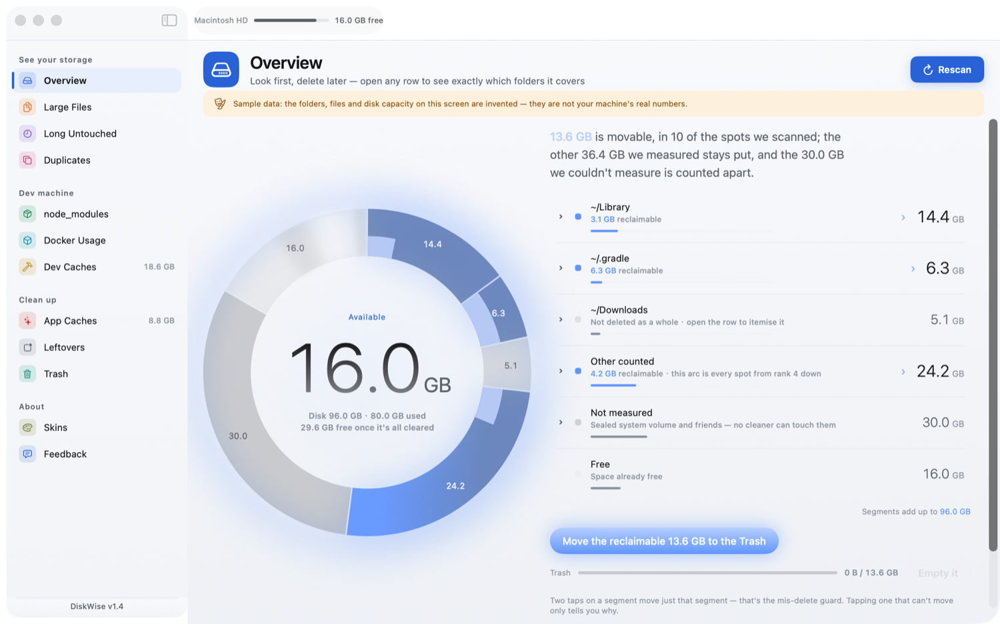
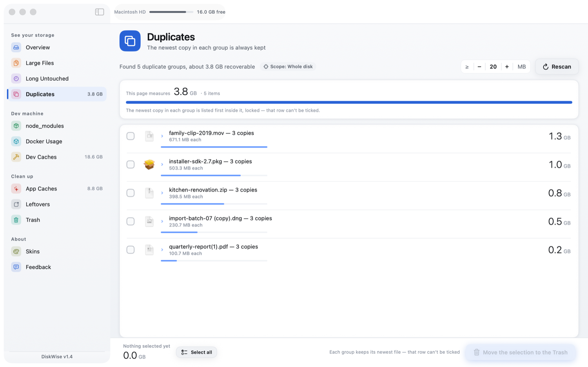
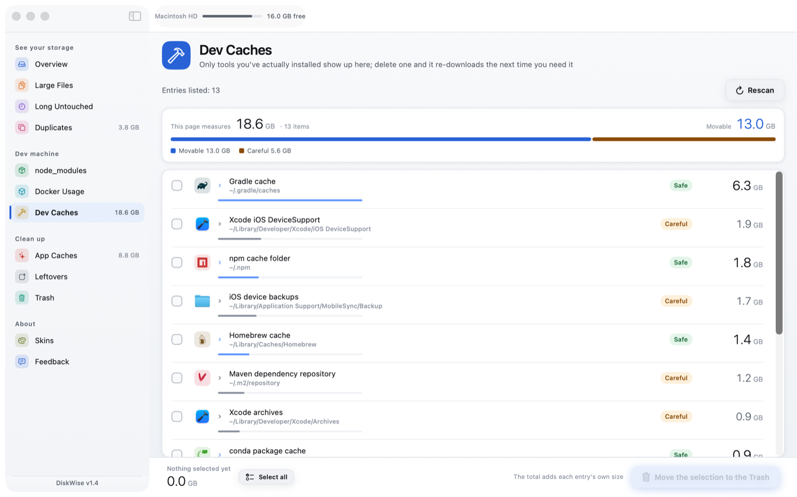
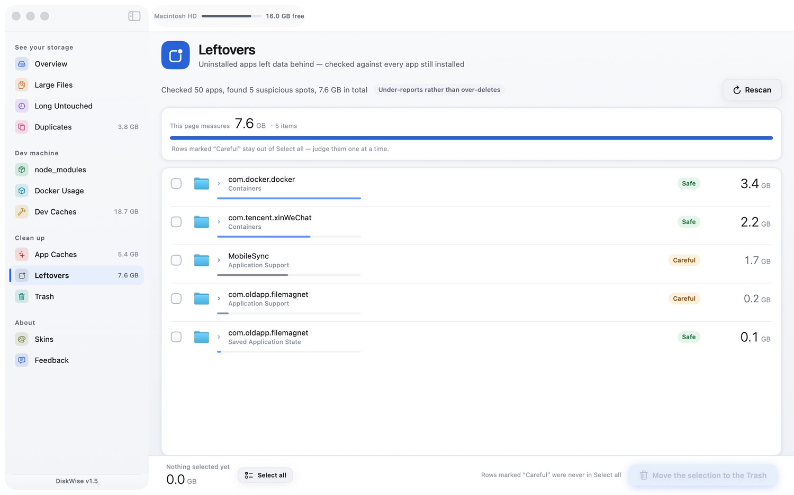
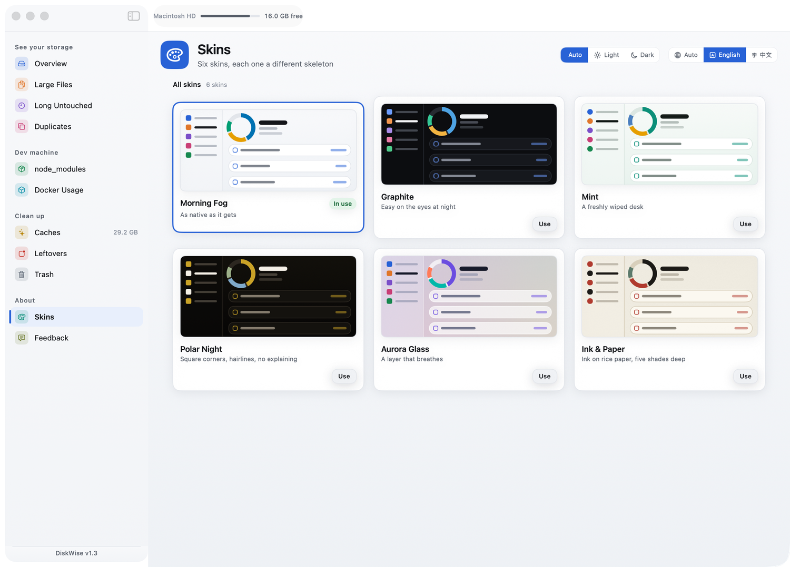
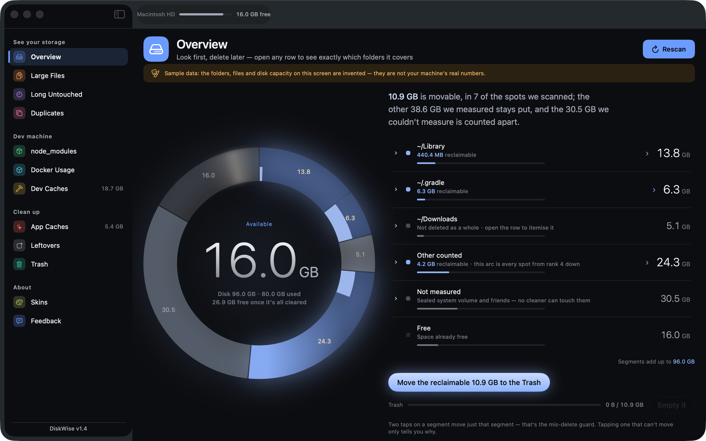
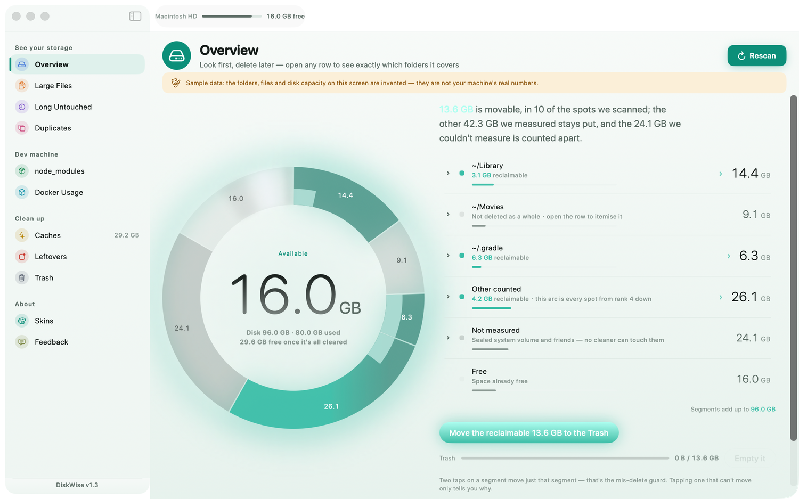
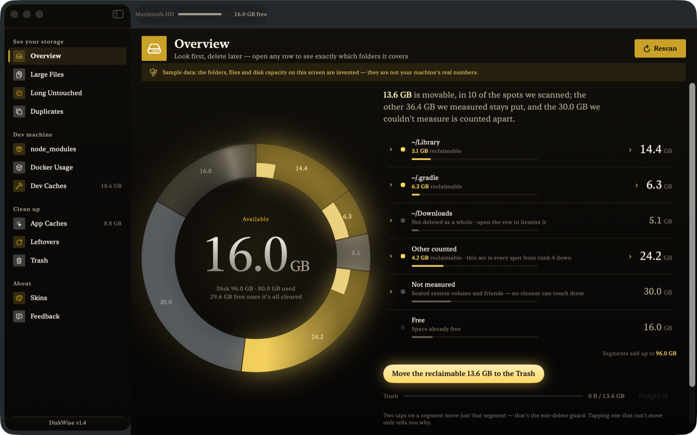
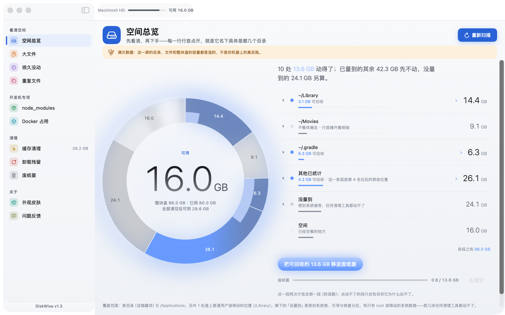
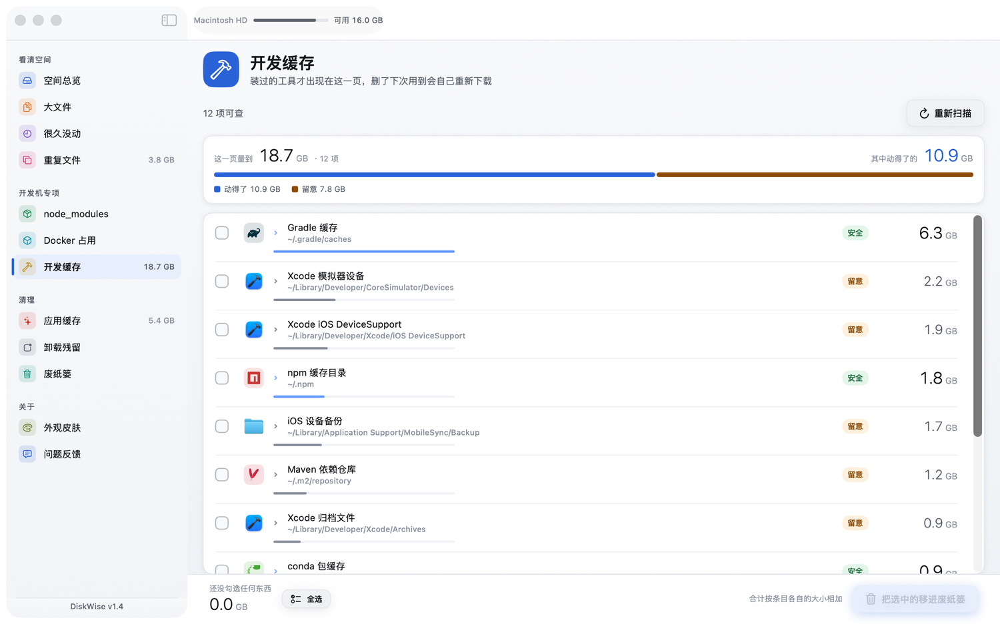

<div align="center">

# DiskWise

**A free, open-source CleanMyMac alternative for macOS.**

A native SwiftUI disk cleaner for `node_modules`, Xcode `DerivedData`, Docker volumes, app
caches and uninstall leftovers — and it never truly deletes anything: every removal goes to
the Trash and stays undoable until *you* empty it. No Electron, no Python sidecar, no local
server, no telemetry, no subscription. A ~5 MB DMG, one file for Apple Silicon and Intel.

English | [简体中文](./README.zh-CN.md)


*Scan → open a row → two taps → undo. Shot against a synthetic home folder, so the numbers on screen are invented — the orange strip says so.*


</div>

```sh
brew install --cask dreamofxm/diskwise/diskwise
```

Or from the **Mac App Store** (macOS 13+, free, and the store keeps you on the latest version):
[DiskWise: Storage Cleaner](https://apps.apple.com/app/id6813265402)

Prefer downloading a local file? [Latest GitHub release](https://github.com/DreamOfXM/diskwise/releases/latest) —
every release ships the DMG's SHA-256.

---

## Contents

- [Quick start](#quick-start)
- [Why this exists](#why-this-exists)
- [What you get](#what-you-get)
- [Screenshots](#screenshots)
- [Install](#install)
- [Build from source](#build-from-source)
- [FAQ](#faq)
- [Known limits](#known-limits)
- [Roadmap](#roadmap)
- [Feedback](#feedback)
- [Privacy](#privacy)
- [License](#license)

## Quick start

The GIF at the top of this page plays this exact order:

1. Open **Overview** — it walks the whole volume and draws the result as one ring, with the ledger
   beside it.
2. Click any row in that ledger — the folders under it unfold right there, and the ring steps back
   to a small reference dial.
3. Click the arc you can move **twice**: the first click arms it, the second moves it to the Trash.
   *Undo* puts it back, and emptying the Trash stays Finder's call.

## Why this exists

A disk cleaner has to read a lot of your machine before it can tell you anything useful. Most of
them are closed-source, ship a background daemon, and treat `rm -rf` as a feature.

We go the other way:

| | DiskWise |
|---|---|
| Delete path | **One** — `FileManager.trashItem`. Everything lands in the Trash. |
| Undo | Yes, per operation, for the whole session. |
| Protected paths | Home itself, `~/Library`, and friends can never be removed wholesale. |
| Emptying the Trash | Finder does it, never this app. Direct build: the app asks Finder and you confirm once more. App Store build: the sandbox kills that event — measured behaviour, no permission prompt even appears — so the same button opens the Trash and you press ⌘⇧⌫. |
| Docker images | Read-only. Virtual disks have no per-image path, so the app points instead of pretending. |
| Network | None. No updater, no analytics, no ads. |
| Price | Nothing. Every feature and all six skins ship unlocked in this build. |
| Runtime | A single `.app`. No Python, no port, no daemon. |

The cache list explains each entry it can — what it is, what happens if you delete it, how it comes
back. We only write that text for entries we actually understand, so some rows carry it and some
don't. WeChat, DingTalk and WeCom are covered, because on many machines those three alone hold tens
of gigabytes.

It is built for machines that have been used by a developer for a few years — the ones where
`node_modules`, Docker volumes, Xcode `DerivedData`, and ten GB of caches quietly took over.

## What you get

**See the space**

- **Overview** — the volume drawn as one ring: a slice is a block of bytes this pass actually
  measured, and the slices add up to the whole disk (top folders + everything else counted + not
  measured + purgeable + free).
  - The light band sits exactly on the edge of what's been measured so far.
  - A slice you can move away whole takes two taps: the first arms it, the second sends it to the
    Trash, and it lets go on its own after 3 seconds.
  - There is one list, the ledger beside the ring. Open a row and its detail unfolds right there —
    the folders under it, the places behind *Other counted*, the volumes behind *Not measured*.
  - While a row is open the ring steps back to a small reference dial, and *Reveal* and *Dig in*
    sit on that row.
- **Whole-disk sweep** — no scope to guess at. The open-source build walks the whole volume
  (whitelisted system roots included, other users' homes included); the sandboxed Mac App Store
  build walks everything its grant can reach and says so on screen.
  - Either way it covers the volume, not just the tidy corners of your home folder.
- **A coverage line that names what it missed** — the overview states how much of your used space it
  actually measured, and names the rest: system volumes, admin-only folders, and folders blocked on
  Full Disk Access.
  - The *Grant access* button only appears when a real read of a protected file says the permission
    is actually missing, so a machine that already granted it never gets nagged again.
  - Every number is decimal, so it matches Finder and About This Mac byte for byte.
- **The "Other counted" slice adds up** — open that row and every place behind the arc is listed
  under it, and the last line spells the total out part by part (the rows listed, plus the ones
  under the 100 MB floor), because "a hundred-plus GB, trust me" is not an explanation.
- **Large Files** — top N across the same roots, dev directories skippable.
- **Long Untouched** — files you haven't opened in N days, across the same roots.
- **Duplicates** — size → partial hash → full hash, grouped, the newest copy in each group locked
  so you can't nuke the only one.
  - Copies that live inside a venv / site-packages / DerivedData never enter the comparison and are
    listed separately: delete one and that environment is short a piece.

**Dev machine specials**

- **node_modules** — project sweep grouped per project, so you see "these 3 checkouts cost 4.7 GB".
- **Docker Usage** — one row per container runtime actually installed (Docker Desktop, OrbStack,
  Podman, colima), measured as what its virtual disk takes on this disk, with the engine's own
  figures listed under it. Read-only: it points at where to prune, it never deletes for you.

**Clean up**

- **App Caches** — a curated knowledge base (system caches, crash dumps, WeChat / DingTalk / WeCom /
  QQ …). Every entry explains *what it is*, *what happens if you delete it*, and *how to get it
  back*, with a Safe / Careful badge.
- **Dev Caches** — the same knowledge base, the tools half of these machines actually fill the disk
  with: Homebrew, npm / pnpm / yarn, Maven, Gradle, conda, uv, cargo, Ollama models, Xcode archives,
  DerivedData and every simulator device listed one by one.
- **Leftovers** — data orphaned by apps you already uninstalled, matched against the bundle IDs of
  everything still installed. Under-reports rather than over-deletes.
- **Trash** — session stats, undo stack, and an *Empty* button: outside the sandbox it asks Finder
  to do the emptying, in the App Store build it opens the Trash so you can press ⌘⇧⌫.

**Personalize**

- **Skins** — 6 themes, and the interesting part is that they are not color swaps: each one changes
  typeface, corner radius, elevation, motion signature and chart palette. Morning Fog, Graphite,
  Mint, Polar Night, Aurora Glass, Ink & Paper — all six are in the box.

## Screenshots

| Overview | Duplicates |
|---|---|
|  |  |

| Dev Caches | Leftovers |
|---|---|
|  |  |

The skin store renders a **live thumbnail** of each theme — mini sidebar, ring gauge, rows and
buttons, all drawn with that skin's real tokens — so you can see the skeleton before you wear it:



Six skins, six skeletons. Same page, three of them — Graphite is the dark one:

| Graphite | Mint | Polar Night |
|---|---|---|
|  |  |  |

The UI is bilingual — English and Simplified Chinese, switchable in-app (Skins → language), and it
follows the system language by default. Same screens in Chinese:

| 空间总览 | 开发缓存 |
|---|---|
|  |  |

## Install

### Mac App Store

[DiskWise: Storage Cleaner](https://apps.apple.com/app/id6813265402) — macOS 13+, free, install it and
start using it; the store takes care of every version after that.

### Homebrew (one command)

```sh
brew install --cask dreamofxm/diskwise/diskwise
```

The fully-qualified name is what makes this work from a third-party tap: since Homebrew 6
non-official taps are untrusted by default, and installing by full name trusts just this
cask. If you would rather use the short name:

```sh
brew tap DreamOfXM/diskwise
brew trust --cask dreamofxm/diskwise/diskwise
brew install --cask diskwise
```

Tap details and how the pinned checksum gets bumped: [DreamOfXM/homebrew-diskwise](https://github.com/DreamOfXM/homebrew-diskwise).

Homebrew installs the same file the Releases page carries, so the first launch still goes through
Gatekeeper: macOS stops it once, and you approve it in **System Settings → Privacy & Security →
Open Anyway** (on macOS 13–14, right-click → Open does the same job). Getting it from the
**Mac App Store** skips that step entirely.

### DMG

1. Download `DiskWise-<version>[-universal].dmg` from
   [Releases](https://github.com/DreamOfXM/diskwise/releases).
2. Open it and drag **DiskWise.app** to *Applications*.
3. The first launch gets stopped once. Approve it in **System Settings → Privacy & Security →
   Open Anyway** and the app opens normally from then on (on macOS 13–14, right-click → Open
   works instead; Sequoia removed that shortcut).

Releases built with `ARCH=universal` are named `…-universal.dmg` and carry both the Apple
Silicon and Intel slices in one file; the Apple Silicon-only ones are named `DiskWise-<version>.dmg`.
Checksums are published next to each release asset, and the cask pins the same SHA-256.

## Build from source

You need the Xcode Command Line Tools — **not** full Xcode.

```bash
swift build                    # debug
swift run SelfTest             # all green is the precondition for shipping
swift run DiskCleaner          # run the app
bash build_app/build.sh        # localize check → build → self-test → .app → sign → dist/*.dmg + SHA256
```

`build.sh` refuses to produce a package if any of the three gates fails: missing translations,
a failing self-test, or an unpacked resource.

Contributing? Start with [CONTRIBUTING.md](CONTRIBUTING.md), then
[docs/ARCHITECTURE.md](docs/ARCHITECTURE.md) and [docs/DESIGN.md](docs/DESIGN.md) — both encode
rules that were learned the expensive way. The most useful first PR is a
[cache knowledge base](CONTRIBUTING.md#the-easiest-useful-contribution-cache-knowledge-base) entry.

## FAQ

**Is this a CleanMyMac alternative?**
In the sense that it covers the same ground — caches, large files, duplicates, uninstall
leftovers, Docker usage — with the source on this page and no subscription. It deliberately
does *less* than a suite: no malware scan, no VPN, no mail cleanup, no "speed booster",
because those are different products with different risks.

**Can it delete something I actually need?**
Anything it removes lands in the Trash, and the session keeps an undo stack. Home itself and
`~/Library` can never be removed wholesale. Emptying the Trash is Finder's job, so macOS asks
you one more time before space is really gone.

**Is it safe to delete `node_modules`, `DerivedData`, caches?**
`node_modules` comes back with `npm install`, `DerivedData` with the next Xcode build, and
caches with the next run of the tool that wrote them. DiskWise states that per entry rather
than assuming you know it — each cache row says what it is, what happens if you delete it, and
how to get it back.

**Does it send data anywhere?**
No. No updater, no analytics, no account, no ads — the app has no network access at all, which
is also why feedback goes through GitHub, email or the QQ group below.

**What about WeChat / DingTalk / WeCom caches?**
They're in the cache knowledge base, because on a Chinese developer's Mac those are often the
single biggest consumers. That's also why the UI ships bilingual.

**Intel Mac?**
From v1.3 on, every published DMG is built with `ARCH=universal` and carries both the arm64 and
x86_64 slices in one file, so the same download works on Apple Silicon and Intel. Releases before
v1.3 shipped an arm64-only file (`DiskWise-<version>.dmg`, no `-universal` in the name); Intel
users on those versions need to build from source instead (it takes a minute and needs no Xcode).
`bash build_app/build.sh` still defaults to Apple Silicon; pass `ARCH=universal` to get both.

**Why does macOS complain on first launch?**
Only the direct download does, and only the first time: approve it in
**System Settings → Privacy & Security → Open Anyway** and it launches normally afterwards; on
macOS 13–14 right-click → Open does the same job, a shortcut Sequoia removed. The App Store build
never gets stopped.

## Known limits

- **The system area is counted, not cleaned.** Rows under `/Library`, `/opt` or `/private` come up
  with a *System area* badge and a locked checkbox: either only an admin can write there, or the
  files belong to Homebrew / Xcode, whose own cleanup commands do a better job.
- **Large `node_modules` sweeps are slow** and don't stream results yet.
- **It will not find every orphan.** Leftover detection is deliberately conservative.

## Roadmap

- [ ] Streaming snapshots for slow scans
- [ ] More cache knowledge base entries (open a PR — this is the easiest way to contribute)

## Feedback

The app has no network access, so there is no built-in "send feedback" button — pick a channel:

| Channel | Where |
|---|---|
| Email | [hnyxgxm2009@163.com](mailto:hnyxgxm2009@163.com) |
| QQ group | **913022339** — scan to join |
| GitHub | [Open an issue](https://github.com/DreamOfXM/diskwise/issues) — English or Chinese is fine |


The same three channels live in-app: the **Feedback** page at the bottom of the sidebar, with
copy buttons for every address.

## Privacy

DiskWise has no network access and collects nothing — every scan runs locally on your Mac.
Full policy: [docs/PRIVACY.md](docs/PRIVACY.md).

## License

Apache License 2.0 — see [LICENSE](LICENSE).
