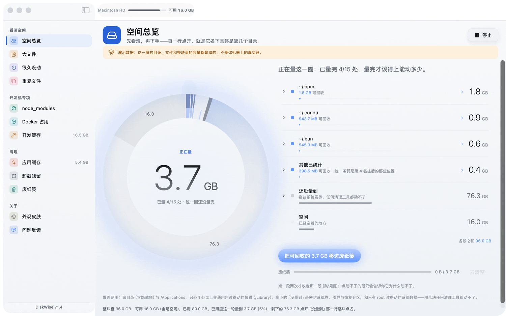
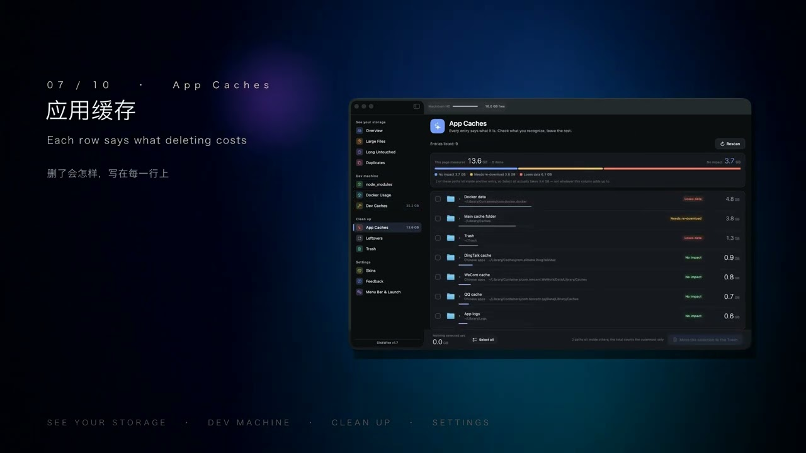
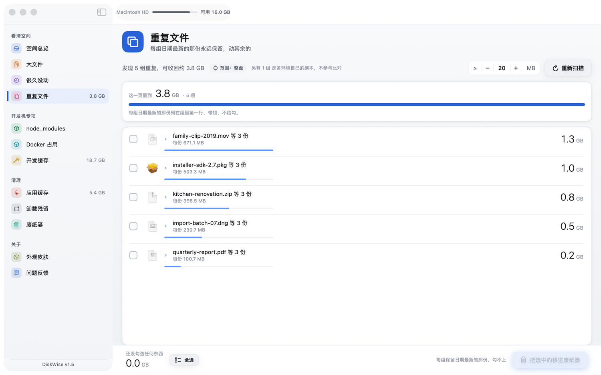
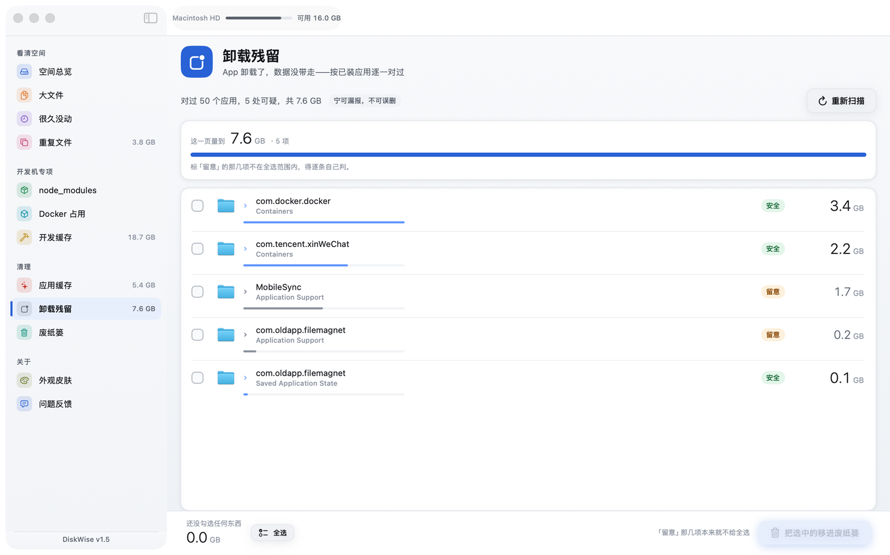
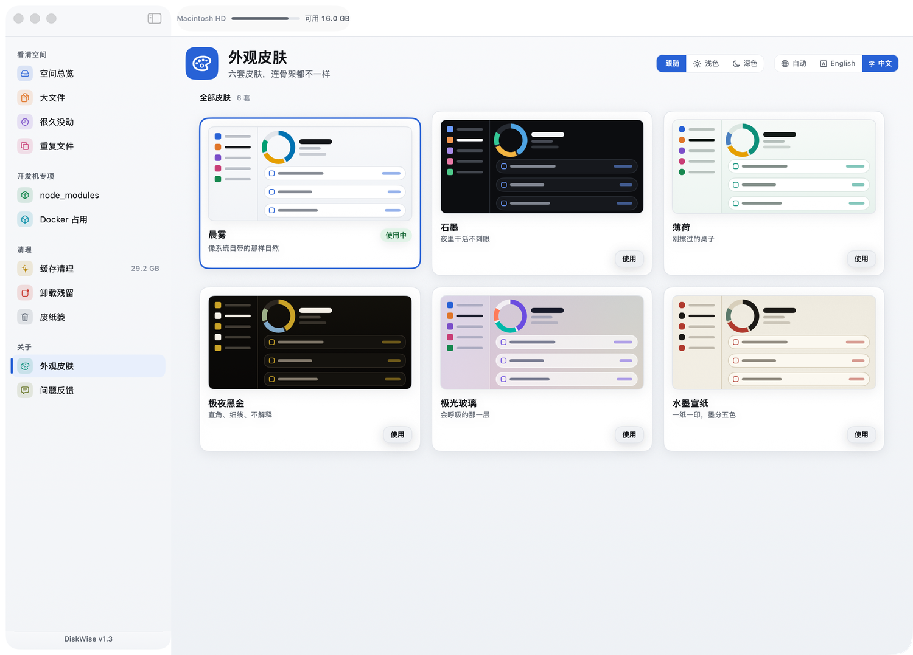
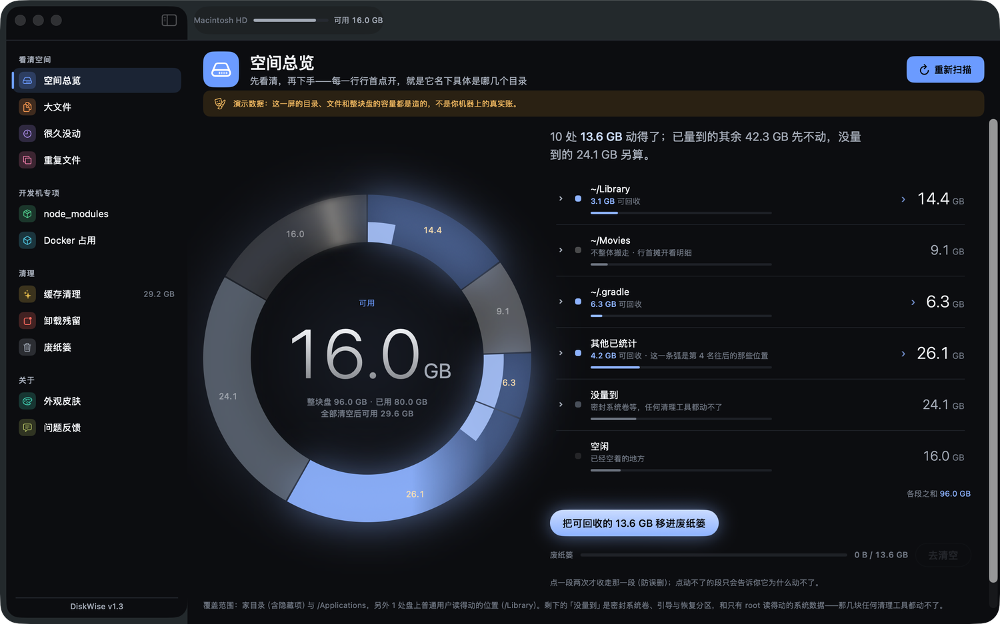
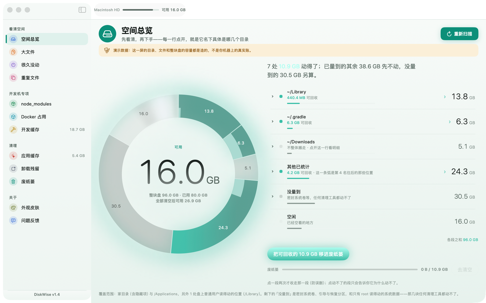
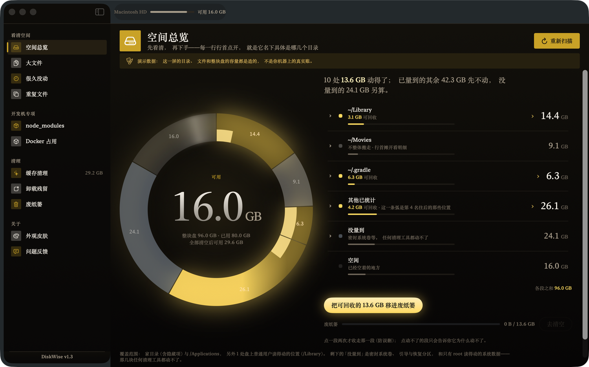

<div align="center">

# DiskWise

**一款免费、开源的 macOS CleanMyMac 替代。**


一个**不会真正删除任何东西**的 macOS 磁盘清理工具：SwiftUI 原生实现，专治开发者机器上的
`node_modules`、Xcode `DerivedData`、Docker 虚拟盘、微信 / 钉钉 / 企业微信缓存和卸载残留。
所有删除只进废纸篓，本次会话内随时可撤销。没有 Electron、不依赖 Python、不起本地服务、
没有端口、不联网、无遥测、无订阅，界面共十种语言。安装包约 5 MB，一个文件同时带
Apple Silicon 和 Intel 两个切片。

[English](./README.md) | 简体中文 | [日本語](./README.ja.md) | [한국어](./README.ko.md)



*扫描 → 点开一行 → 两下 → 撤销。这屏跑的是造出来的演示目录，屏幕上的数都是编的——顶上那条橙色横幅写的就是这件事。*

[](https://www.youtube.com/watch?v=ePKOkt2h70w)

*▶ 43 秒演示片（YouTube）。*

</div>

```bash
brew install --cask dreamofxm/diskwise/diskwise
```

或从 **Mac App Store** 获取（macOS 13+，免费，之后由商店自动推送更新）：
[DiskWise: 空间清理](https://apps.apple.com/app/id6813265402)

想直接下载文件？[最新的 GitHub Release](https://github.com/DreamOfXM/diskwise/releases/latest)——
每条 Release 都附 DMG 的 SHA-256。

---

## 目录

- [上手三步](#上手三步)
- [给 AI agent 用](#给-ai-agent-用)
- [为什么选择 DiskWise](#为什么选择-diskwise)
- [功能](#功能)
- [界面截图](#界面截图)
- [下载与安装](#下载与安装)
- [从源码构建](#从源码构建)
- [常见问题](#常见问题)
- [已知不足](#已知不足)
- [路线图](#路线图)
- [反馈与交流](#反馈与交流)
- [隐私](#隐私)
- [许可](#许可)

## 上手三步

本页顶部那段录屏演的就是这个顺序：

1. 打开**空间总览**：它走整块盘，把结果画成一个环，环旁边那一列就是账。
2. 点账里的任意一行——它名下是哪几个目录就地摊开，环同时收成一枚小参照盘。
3. 能整个搬走的那段弧**点两下**：第一下上膛，第二下才进废纸篓。*撤销*原样放回，清空废纸篓始终由访达执行。

## 给 AI agent 用

直装版附带 `diskwise` 命令行（App Store 版不带），它同时是一个 MCP
（Model Context Protocol）服务——让 Claude Code、Cursor、Codex 替你清磁盘。
它不能 `rm -rf`：唯一删除路径是把知识库认得且判为安全的位置移进废纸篓，
每一步都能整单撤销，会丢数据的位置永远动不了。

```sh
claude mcp add diskwise -- /Applications/DiskWise.app/Contents/MacOS/diskwise mcp
```

然后直接对 agent 说「看看我 Mac 上哪里值得清」：它会扫描、出计划、把摘要
给你过目，你点头之后才动手。配置片段、完整安全模型与命令清单见
[docs/AGENTS-CLI.md](docs/AGENTS-CLI.md)。
## 为什么选择 DiskWise

清理工具要进入你的家目录，劝你删东西。多数同类产品闭源、常驻后台进程、把 `rm -rf` 当卖点。

DiskWise 走相反的路子：

| | DiskWise |
|---|---|
| 删除路径 | **全 App 只有一条** —— `FileManager.trashItem`，一律进废纸篓 |
| 撤销 | 支持，按操作、整会话可退 |
| 保护路径 | 家目录本体、`~/Library` 等整体不可删，子项可以 |
| 清空废纸篓 | 动手的永远是**访达**，本工具从不自己永久删除。直链版：请访达清空，访达会让你确认一次。商店沙盒版：这条指令被系统掐掉（实测连授权框都不弹），同一颗按钮改成打开废纸篓窗口，你按 ⌘⇧⌫ |
| Docker 镜像 | 只读。虚拟盘没有独立路径，App 只指路不代删 |
| 联网 | 无。不自动更新、不统计、无广告 |
| 收费 | 无。功能全开，六套皮肤全部随包可用 |
| 运行形态 | 一个 `.app`，没有 Python、没有端口、没有守护进程 |

缓存列表里能解释的条目都写着解释——这是什么、删了会怎样、怎么回来。我们只给真看得懂的条目写这段
文字，所以有的行有、有的行没有。微信、钉钉、企业微信都在内，因为很多机器上这三项就占几十 GB。

它服务的是被开发者用了几年的那类机器——`node_modules`、Docker 虚拟盘、Xcode `DerivedData`、
十几 GB 缓存悄悄把盘吃掉的那种。

## 功能

**看清空间**

- **空间总览**：整块盘画成一个环——一段弧就是这一轮真量到的字节，各段加起来正好等于整块盘
  （前几大热点 + 其他已统计 + 没量到 + 系统可清除 + 空闲）。
  - 那道光带就停在「量到这儿」的边界上。
  - 能整个搬走的那一段点两下：第一下上膛，第二下才进废纸篓，3 秒不点自己松开。
  - 整页只有一段账：环旁边那一列。点这一行就**就地摊开**它名下是哪几个目录、「其他已统计」背后
    是哪几处位置、「没量到」是哪几卷账。
  - 摊开的时候环收成一枚小参照盘，「访达显示」和「深挖」挂在摊开的这一行上。
- **走整盘扫描**：没有范围开关要猜。开源版整趟走整盘（白名单里的系统根、别人的家目录都在内）；
  商店沙盒版走授权能达到的最大范围，并把这个边界写在界面上。
  - 两边扫的都是整块盘，不是家目录里那几处整洁的角落。
- **覆盖范围那行会点名没量到的地方**：总览常驻一行「已量到 X，占已用的 Y%」，并列出没量到的是谁的地盘——系统卷、
  只有管理员能读的目录、以及读不动的那几处。
  - 那颗跳「完全磁盘访问权限」设置的按钮只在实测读不到受保护文件时才出现，已经授权过的人不会再被
    喊一次「去授权」。
  - 所有体积按十进制算，跟访达、「关于本机」逐字节对得上。
- **「其他已统计」凑得出来**：点开那一格，这块弧名下的每一处都列在它自己名下，最后一句把没点名的
  补齐（这里这几处 ＋ 不到 100 MB 的那几处），几段相加就等于弧上那个数——一百多 G 不能只写成一句
  「信我」。
- **大文件**：按同一批范围根遍历，TOP 可调，可跳过开发目录。
- **很久没动**：同样这些根里，N 天没打开的文件。
- **重复文件**：大小 → 部分哈希 → 全量哈希，分组展示，每组日期最新一份锁定保留。
  - 住在 venv / site-packages / DerivedData 里的副本不参与比对，单独列成一份名单——删一份，
    那个环境就缺一块。

**开发机专项**

- **node_modules**：按项目聚合，直接告诉你「这几个仓库共 4.7 GB」。
- **Docker 占用**：机器上装了哪家容器运行时（Docker Desktop / OrbStack / Podman / colima）就出一行，
  量的是那块虚拟机磁盘在这台机器上实际占掉的量；引擎自己报的几段列在下面。**只出不删**——删法各家
  不一样，展开那一行给指路。

**清理**

- **应用缓存**：知识库覆盖系统缓存总目录、崩溃转储、微信 / 钉钉 / 企业微信 / QQ 等。每项都写明
  「这是什么 / 删了会怎样 / 怎么恢复」，徽章上直接写删了要付什么代价——安全、能重下，还是会丢数据。
- **开发缓存**：同一本知识库的另一半——Homebrew、npm / pnpm / yarn、Maven、Gradle、conda、uv、
  cargo、Ollama 模型、Xcode 归档与 DerivedData，iOS 模拟器逐台列占用与上次启动时间。
- **卸载残留**：以「还装着的 App 的 bundle id」为基准找孤儿，宁可漏报不误删。
- **废纸篓**：体积统计、撤销栈，以及一颗「清空」——直链版由访达执行，商店沙盒版只把废纸篓窗口打开
  给你按 ⌘⇧⌫。

**个性化**

- **外观皮肤**：6 套。关键点是它们**不是换色**——每套各自改字体面、圆角、材质分层、动效签名、
  图表配色。晨雾 / 石墨 / 薄荷 / 极夜黑金 / 极光玻璃 / 水墨宣纸，六套全部随包可用。
- **皮肤是数据，不是代码**：六套全在
  [`Sources/DiskCleaner/Resources/skins.json`](Sources/DiskCleaner/Resources/skins.json) 这一个文件里，
  文件自己带着每个字段的说明。加第七套就是加一个 JSON 对象：在 GitHub 网页上改这个文件、提 PR 即可，
  不用 Xcode、不用编译、不用写 Swift。

## 界面截图

| 空间总览 | 重复文件 |
|---|---|
|  |  |

| 开发缓存 | 卸载残留 |
|---|---|
|  |  |

皮肤页里每张卡都实时渲染该皮肤下的迷你侧边栏 + 环形图 + 列表行 + 按钮，看得懂骨架再决定穿不穿：



同一页，三套皮肤三种骨架（默认「晨雾」见页首那张图），其中石墨是深色那套：

| 石墨 | 薄荷 | 极夜黑金 |
|---|---|---|
|  |  |  |

界面共十种语言——英语、简体中文、繁体中文、日语、韩语、德语、西班牙语、法语、俄语、巴西葡语——
在「外观皮肤」页的语言菜单里切换，默认跟随系统。同样的几屏，英文界面长这样：

| Overview | Dev Caches |
|---|---|
|  |  |

数量不是把英文拼上去了事，每种语言各按各的规矩变形：俄语按数字挑形态（`1 файл`、`3 файла`、
`11 групп`），德语法语西语巴葡分单复数，日韩用它们自己真在用的量词。

## 下载与安装

### Mac App Store

[DiskWise: 空间清理](https://apps.apple.com/app/id6813265402) — macOS 13+｜免费｜直接获取即可开始用，
之后的新版本由商店自动接手。

商店接手的每一版都要先过苹果审核，所以商店里能拿到的版本会比 GitHub Release 慢一些。想要刚发出来的
那一版，用下面的 Homebrew 或直接下载 DMG。

### Homebrew（一条命令）

```bash
brew install --cask dreamofxm/diskwise/diskwise
```

必须用 `dreamofxm/diskwise/diskwise` 这个全限定名：Homebrew 6 起第三方 tap 默认不被信任，
按全限定名安装只信任这一个 cask。想用短名就先补一步信任：

```bash
brew tap DreamOfXM/diskwise
brew trust --cask dreamofxm/diskwise/diskwise
brew install --cask diskwise
```

tap 的细节与校验值怎么更新：[DreamOfXM/homebrew-diskwise](https://github.com/DreamOfXM/homebrew-diskwise)。

用 Homebrew 装的也是 Releases 页那个文件。从 v1.7 起那份用 Developer ID 证书签名并经苹果公证，
双击即可打开，不需要任何额外放行；v1.7 之前发的是 ad-hoc 签名的包，首次打开会被系统拦一次，要到
**系统设置 → 隐私与安全性 → 「仍要打开」**里放行（macOS 13–14 上右键 → 打开 也能顶过去）。
从 **Mac App Store** 装的那份完全没有这一步。

### 直接下载 DMG

1. 到 [Releases](https://github.com/DreamOfXM/diskwise/releases) 下载 `DiskWise-<版本号>[-universal].dmg`
2. 打开后把 **DiskWise.app** 拖进「应用程序」
3. 双击即可打开——v1.7 起的包已 Developer ID 签名并通过苹果公证，系统不拦；v1.7 之前的包首次会被拦
   一下，到**系统设置 → 隐私与安全性 → 「仍要打开」**里放行，之后就能正常双击打开
   （macOS 13–14 用老办法：右键 → 打开；Sequoia 把这条捷径去掉了）

`ARCH=universal` 出的包文件名带 `-universal`，同一个文件里同时有 arm64 和 x86_64 两个切片；
不带后缀的那份只有 Apple Silicon。每个 Release 都会附 DMG 的 SHA256，cask 里钉的是同一个校验值。

## 从源码构建

只需要 Xcode 命令行工具，**不需要完整 Xcode**。

```bash
swift build                    # debug 编译
swift run SelfTest             # 全量自检，全绿是打包前提
swift run DiskCleaner          # 直跑 App
bash build_app/build.sh        # 多语言对账 → 编译 → 自检 → .app → 签名 → dist/*.dmg + SHA256
```

三道闸门任一失败就不出包：缺译文、自检不过、资源没拷进去。译文那道闸门会自己解析 Swift 源码和
`skins.json`，所以漏包 `L(…)` 的新字符串会和漏译一样被拦下——一门语言不可能悄悄只译一半。

想提 PR 请先读 [CONTRIBUTING.md](CONTRIBUTING.md)、[docs/ARCHITECTURE.md](docs/ARCHITECTURE.md)
和 [docs/DESIGN.md](docs/DESIGN.md)——里面每条规则都是踩过坑定下来的。
有三类 PR 完全不用碰 Swift：[缓存知识库](CONTRIBUTING.md#the-easiest-useful-contribution-cache-knowledge-base)加一条真实条目、[加一套皮肤](CONTRIBUTING.md#skins)、或者[补一门语言](CONTRIBUTING.md#translations)。

## 常见问题

**它是 CleanMyMac 的免费替代吗？**
在同一件事上替代——缓存、大文件、重复文件、卸载残留、Docker 占用，源码就在这个仓库，不收订阅。
它刻意比套件少做很多：不查杀木马、不做 VPN、不清邮件、没有「加速」，因为那些是另一类产品、另一套风险。

**会不会把我还要的东西删掉？**
所有删除都进废纸篓，本次会话有撤销栈；家目录本体和 `~/Library` 整体不可删；清空这一步永远在
访达里完成，访达会让你确认后才真正释放空间。

**`node_modules`、`DerivedData`、各种缓存能删吗？**
能。`node_modules` 靠 `npm install` 回来，`DerivedData` 靠下次编译回来，缓存靠对应工具的下次运行回来。
DiskWise 不假设你知道这件事，每一条都写着「这是什么 / 删了会怎样 / 怎么回来」。

**它会上传什么吗？**
不会。App 里没有内置更新器、没有统计、没有账号、没有广告，完全没有网络访问 —— 这也是反馈只能走
GitHub 或邮箱的原因。

**微信 / 钉钉的缓存管吗？**
管，缓存在知识库里。中文开发者的 Mac 上这几项往往是最占地方的，简体与繁体中文也因此都是一等公民，
而不是挂在英文界面后面的补丁。

**Intel 机器能用吗？**
从 v1.3 起，发出去的每个 DMG 都是 `ARCH=universal` 出的，同一个文件里 arm64 和 x86_64 两个切片
都在，Intel 和 Apple Silicon 下载同一个链接即可。v1.3 之前的 Release 附的是只带 arm64 的
`DiskWise-<版本号>.dmg`（文件名没有 `-universal`），那几个版本要 Intel 就得自己编一条命令的事
（不需要完整 Xcode）。本地 `build.sh` 默认仍只出 Apple Silicon，加 `ARCH=universal` 才出双切片。

**为什么首次打开系统要警告？**
v1.7 起不会了：v1.7 之后发出去的每一个包都用 Developer ID 证书签名并经苹果公证，Gatekeeper 直接放行。
更早那种 ad-hoc 签名的包只拦第一次：到**系统设置 → 隐私与安全性 → 「仍要打开」**点一下，
之后就正常了；macOS 13–14 用右键 → 打开也行，Sequoia 去掉了这条。App Store 那份永远不会被拦。

## 已知不足

- **整盘那一趟只负责把系统区算进账，不负责删它**：`/Library`、`/opt`、`/private` 里的行会带
  「系统区」标记、勾选框锁死——那些位置要么只有管理员写得动，要么归 Homebrew / Xcode 自己管，
  用它们各自的清理命令比这个按钮安全
- **node_modules 大盘扫描慢**，且还没有流式快照
- **卸载残留刻意保守**，会漏报

## 路线图

- [ ] 慢扫描的流式快照
- [ ] 扩充缓存知识库（提 PR 最受欢迎的方式）

## 反馈与交流

App 不联网，所以没有「一键发送反馈」这种按钮。两个渠道随你挑：

| 渠道 | 入口 |
|---|---|
| 邮箱 | [hnyxgxm2009@163.com](mailto:hnyxgxm2009@163.com) |
| GitHub | [提 Issue](https://github.com/DreamOfXM/diskwise/issues)，中文英文都收 |
| Discussions | [提问、想法、用法分享](https://github.com/DreamOfXM/diskwise/discussions) |

邮箱和 Issue 在 App 里也有：侧边栏最下面的「问题反馈」页，每个地址都能一键复制。

如果它清出了你本来不知道的占用空间，[给仓库点个 Star](https://github.com/DreamOfXM/diskwise) 就是新用户
找到它的实际途径——这个项目没有投放预算，能不能被人看见，全靠 GitHub 自己的搜索和 awesome 列表流量。

## 隐私

DiskWise 不联网、不收集任何数据，每一次扫描都只在你自己的 Mac 上完成。
完整政策见 [docs/PRIVACY.md](docs/PRIVACY.md)。

## 许可

Apache License 2.0，见 [LICENSE](LICENSE)。
